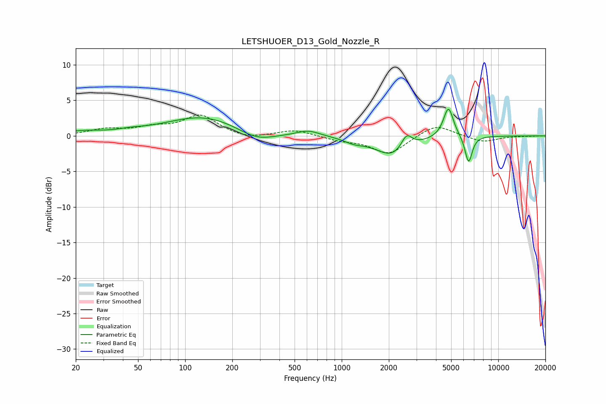

# LETSHUOER_D13_Gold_Nozzle_R
See [usage instructions](https://github.com/jaakkopasanen/AutoEq#usage) for more options and info.

### Parametric EQs
Apply preamp of -3.8 dB when using parametric equalizer.

|   # | Type    |   Fc (Hz) |    Q |   Gain (dB) |
|-----|---------|-----------|------|-------------|
|   1 | Peaking |        22 | 1.19 |         0.5 |
|   2 | Peaking |        45 | 1.7  |         0.3 |
|   3 | Peaking |       131 | 0.58 |         2.8 |
|   4 | Peaking |       285 | 1.19 |        -1.5 |
|   5 | Peaking |       612 | 1.95 |         0.8 |
|   6 | Peaking |      1199 | 2.25 |        -0.6 |
|   7 | Peaking |      2127 | 1.3  |        -2.9 |
|   8 | Peaking |      2594 | 4.02 |         2.1 |
|   9 | Peaking |      4806 | 4.38 |         4.3 |
|  10 | Peaking |      6465 | 5.97 |        -3.9 |

### Fixed Band EQs
When using fixed band (also called graphic) equalizer, apply preamp of **-3.0 dB** (if available) and set gains manually with these parameters.

|   # | Type    |   Fc (Hz) |    Q |   Gain (dB) |
|-----|---------|-----------|------|-------------|
|   1 | Peaking |        31 | 1.41 |         0.8 |
|   2 | Peaking |        62 | 1.41 |         1   |
|   3 | Peaking |       125 | 1.41 |         2.8 |
|   4 | Peaking |       250 | 1.41 |        -0.5 |
|   5 | Peaking |       500 | 1.41 |         0.9 |
|   6 | Peaking |      1000 | 1.41 |        -0.6 |
|   7 | Peaking |      2000 | 1.41 |        -2.6 |
|   8 | Peaking |      4000 | 1.41 |         1.7 |
|   9 | Peaking |      8000 | 1.41 |        -0.9 |
|  10 | Peaking |     16000 | 1.41 |        -0   |

### Graphs

