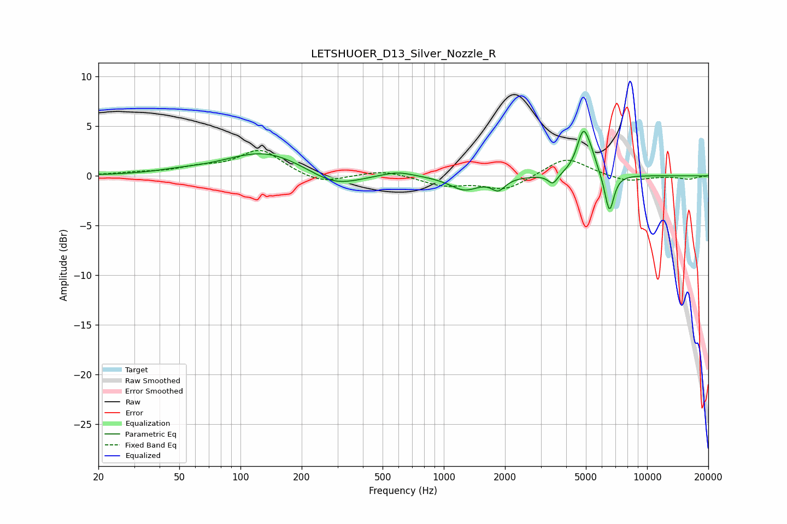

# LETSHUOER_D13_Silver_Nozzle_R
See [usage instructions](https://github.com/jaakkopasanen/AutoEq#usage) for more options and info.

### Parametric EQs
Apply preamp of -4.6 dB when using parametric equalizer.

|   # | Type    |   Fc (Hz) |    Q |   Gain (dB) |
|-----|---------|-----------|------|-------------|
|   1 | Peaking |        50 | 1.28 |         0.2 |
|   2 | Peaking |       132 | 0.73 |         2.5 |
|   3 | Peaking |       289 | 1.13 |        -1.5 |
|   4 | Peaking |       590 | 1.8  |         0.5 |
|   5 | Peaking |      1263 | 1.96 |        -1.4 |
|   6 | Peaking |      1855 | 4.26 |        -1.2 |
|   7 | Peaking |      3442 | 6    |        -1   |
|   8 | Peaking |      4858 | 4.28 |         4.3 |
|   9 | Peaking |      5336 | 4.97 |         0.9 |
|  10 | Peaking |      6525 | 6    |        -4   |

### Fixed Band EQs
When using fixed band (also called graphic) equalizer, apply preamp of **-2.7 dB** (if available) and set gains manually with these parameters.

|   # | Type    |   Fc (Hz) |    Q |   Gain (dB) |
|-----|---------|-----------|------|-------------|
|   1 | Peaking |        31 | 1.41 |         0.2 |
|   2 | Peaking |        62 | 1.41 |         0.7 |
|   3 | Peaking |       125 | 1.41 |         2.6 |
|   4 | Peaking |       250 | 1.41 |        -0.9 |
|   5 | Peaking |       500 | 1.41 |         0.6 |
|   6 | Peaking |      1000 | 1.41 |        -0.9 |
|   7 | Peaking |      2000 | 1.41 |        -1.4 |
|   8 | Peaking |      4000 | 1.41 |         1.9 |
|   9 | Peaking |      8000 | 1.41 |        -0.6 |
|  10 | Peaking |     16000 | 1.41 |        -0.3 |

### Graphs

