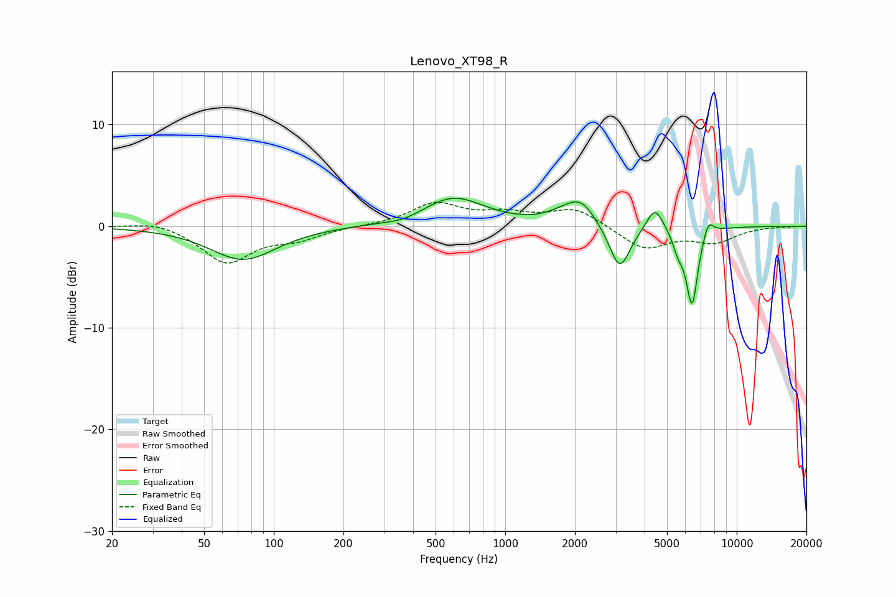

# Lenovo_XT98_R
See [usage instructions](https://github.com/jaakkopasanen/AutoEq#usage) for more options and info.

### Parametric EQs
Apply preamp of -2.8 dB when using parametric equalizer.

|   # | Type    |   Fc (Hz) |    Q |   Gain (dB) |
|-----|---------|-----------|------|-------------|
|   1 | Peaking |        74 | 0.99 |        -3.3 |
|   2 | Peaking |       365 | 1.9  |        -0.4 |
|   3 | Peaking |       597 | 1.05 |         2.8 |
|   4 | Peaking |      1774 | 1.96 |         0.7 |
|   5 | Peaking |      2130 | 2.26 |         2.2 |
|   6 | Peaking |      3123 | 3.11 |        -4.5 |
|   7 | Peaking |      4433 | 3.92 |         2.4 |
|   8 | Peaking |      5587 | 5.99 |        -1.6 |
|   9 | Peaking |      6412 | 5.34 |        -7.6 |
|  10 | Peaking |      7540 | 5.96 |         1.6 |

### Fixed Band EQs
When using fixed band (also called graphic) equalizer, apply preamp of **-2.5 dB** (if available) and set gains manually with these parameters.

|   # | Type    |   Fc (Hz) |    Q |   Gain (dB) |
|-----|---------|-----------|------|-------------|
|   1 | Peaking |        31 | 1.41 |         0.6 |
|   2 | Peaking |        62 | 1.41 |        -3.6 |
|   3 | Peaking |       125 | 1.41 |        -1.1 |
|   4 | Peaking |       250 | 1.41 |         0   |
|   5 | Peaking |       500 | 1.41 |         2.2 |
|   6 | Peaking |      1000 | 1.41 |         1.1 |
|   7 | Peaking |      2000 | 1.41 |         1.7 |
|   8 | Peaking |      4000 | 1.41 |        -2.3 |
|   9 | Peaking |      8000 | 1.41 |        -1.5 |
|  10 | Peaking |     16000 | 1.41 |        -0   |

### Graphs

