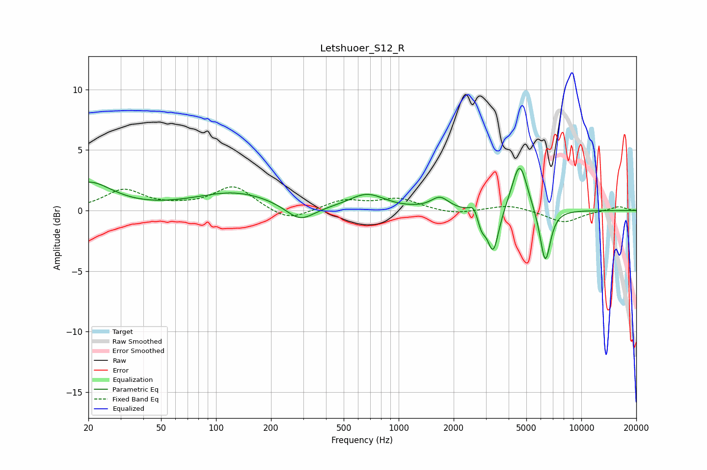

# Letshuoer_S12_R
See [usage instructions](https://github.com/jaakkopasanen/AutoEq#usage) for more options and info.

### Parametric EQs
Apply preamp of -3.6 dB when using parametric equalizer.

|   # | Type    |   Fc (Hz) |    Q |   Gain (dB) |
|-----|---------|-----------|------|-------------|
|   1 | Peaking |        20 | 1.1  |         2.3 |
|   2 | Peaking |       128 | 0.65 |         1.5 |
|   3 | Peaking |       288 | 1.81 |        -1.4 |
|   4 | Peaking |       670 | 1.45 |         1.3 |
|   5 | Peaking |      1682 | 2.96 |         1   |
|   6 | Peaking |      2577 | 6    |         0.8 |
|   7 | Peaking |      2841 | 5.99 |        -1.2 |
|   8 | Peaking |      3296 | 4.59 |        -3.6 |
|   9 | Peaking |      4595 | 3.31 |         4.1 |
|  10 | Peaking |      6348 | 4.74 |        -4.5 |

### Fixed Band EQs
When using fixed band (also called graphic) equalizer, apply preamp of **-2.0 dB** (if available) and set gains manually with these parameters.

|   # | Type    |   Fc (Hz) |    Q |   Gain (dB) |
|-----|---------|-----------|------|-------------|
|   1 | Peaking |        31 | 1.41 |         1.7 |
|   2 | Peaking |        62 | 1.41 |         0.2 |
|   3 | Peaking |       125 | 1.41 |         2   |
|   4 | Peaking |       250 | 1.41 |        -1   |
|   5 | Peaking |       500 | 1.41 |         0.8 |
|   6 | Peaking |      1000 | 1.41 |         0.9 |
|   7 | Peaking |      2000 | 1.41 |        -0.4 |
|   8 | Peaking |      4000 | 1.41 |         0.5 |
|   9 | Peaking |      8000 | 1.41 |        -1   |
|  10 | Peaking |     16000 | 1.41 |         0.4 |

### Graphs

