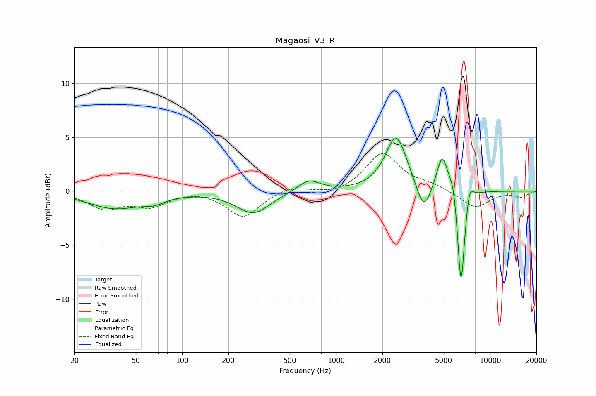

# Magaosi_V3_R
See [usage instructions](https://github.com/jaakkopasanen/AutoEq#usage) for more options and info.

### Parametric EQs
Apply preamp of -5.0 dB when using parametric equalizer.

|   # | Type    |   Fc (Hz) |    Q |   Gain (dB) |
|-----|---------|-----------|------|-------------|
|   1 | Peaking |        36 | 0.82 |        -1.5 |
|   2 | Peaking |        66 | 1.94 |        -0.6 |
|   3 | Peaking |       290 | 1.31 |        -2   |
|   4 | Peaking |       664 | 1.96 |         1.1 |
|   5 | Peaking |      2458 | 2.02 |         5.1 |
|   6 | Peaking |      3707 | 3.08 |        -2.7 |
|   7 | Peaking |      4902 | 3.76 |         3.5 |
|   8 | Peaking |      5770 | 6    |         1.4 |
|   9 | Peaking |      6483 | 6    |        -9.4 |
|  10 | Peaking |      7374 | 5.97 |         1.6 |

### Fixed Band EQs
When using fixed band (also called graphic) equalizer, apply preamp of **-3.6 dB** (if available) and set gains manually with these parameters.

|   # | Type    |   Fc (Hz) |    Q |   Gain (dB) |
|-----|---------|-----------|------|-------------|
|   1 | Peaking |        31 | 1.41 |        -1.5 |
|   2 | Peaking |        62 | 1.41 |        -1.3 |
|   3 | Peaking |       125 | 1.41 |         0.2 |
|   4 | Peaking |       250 | 1.41 |        -2.4 |
|   5 | Peaking |       500 | 1.41 |         0.5 |
|   6 | Peaking |      1000 | 1.41 |        -0.4 |
|   7 | Peaking |      2000 | 1.41 |         3.5 |
|   8 | Peaking |      4000 | 1.41 |         0.5 |
|   9 | Peaking |      8000 | 1.41 |        -1.6 |
|  10 | Peaking |     16000 | 1.41 |        -0.5 |

### Graphs

