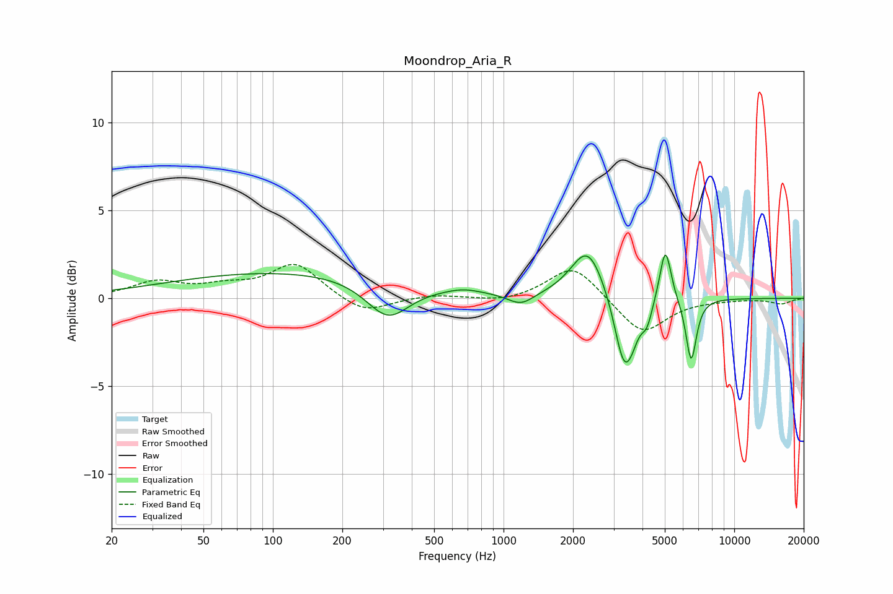

# Moondrop_Aria_R
See [usage instructions](https://github.com/jaakkopasanen/AutoEq#usage) for more options and info.

### Parametric EQs
Apply preamp of -2.6 dB when using parametric equalizer.

|   # | Type    |   Fc (Hz) |    Q |   Gain (dB) |
|-----|---------|-----------|------|-------------|
|   1 | Peaking |       123 | 0.25 |         1.5 |
|   2 | Peaking |       315 | 1.49 |        -2.2 |
|   3 | Peaking |       672 | 2    |         0.2 |
|   4 | Peaking |      1190 | 2.49 |        -0.7 |
|   5 | Peaking |      2316 | 1.96 |         2.9 |
|   6 | Peaking |      3318 | 3.4  |        -3.8 |
|   7 | Peaking |      3607 | 4.26 |        -0.9 |
|   8 | Peaking |      4184 | 6    |        -1.1 |
|   9 | Peaking |      5030 | 5.7  |         3.2 |
|  10 | Peaking |      6505 | 6    |        -3.6 |

### Fixed Band EQs
When using fixed band (also called graphic) equalizer, apply preamp of **-2.0 dB** (if available) and set gains manually with these parameters.

|   # | Type    |   Fc (Hz) |    Q |   Gain (dB) |
|-----|---------|-----------|------|-------------|
|   1 | Peaking |        31 | 1.41 |         0.9 |
|   2 | Peaking |        62 | 1.41 |         0.5 |
|   3 | Peaking |       125 | 1.41 |         2   |
|   4 | Peaking |       250 | 1.41 |        -0.9 |
|   5 | Peaking |       500 | 1.41 |         0.2 |
|   6 | Peaking |      1000 | 1.41 |        -0.2 |
|   7 | Peaking |      2000 | 1.41 |         2   |
|   8 | Peaking |      4000 | 1.41 |        -2.1 |
|   9 | Peaking |      8000 | 1.41 |        -0.1 |
|  10 | Peaking |     16000 | 1.41 |        -0.3 |

### Graphs

