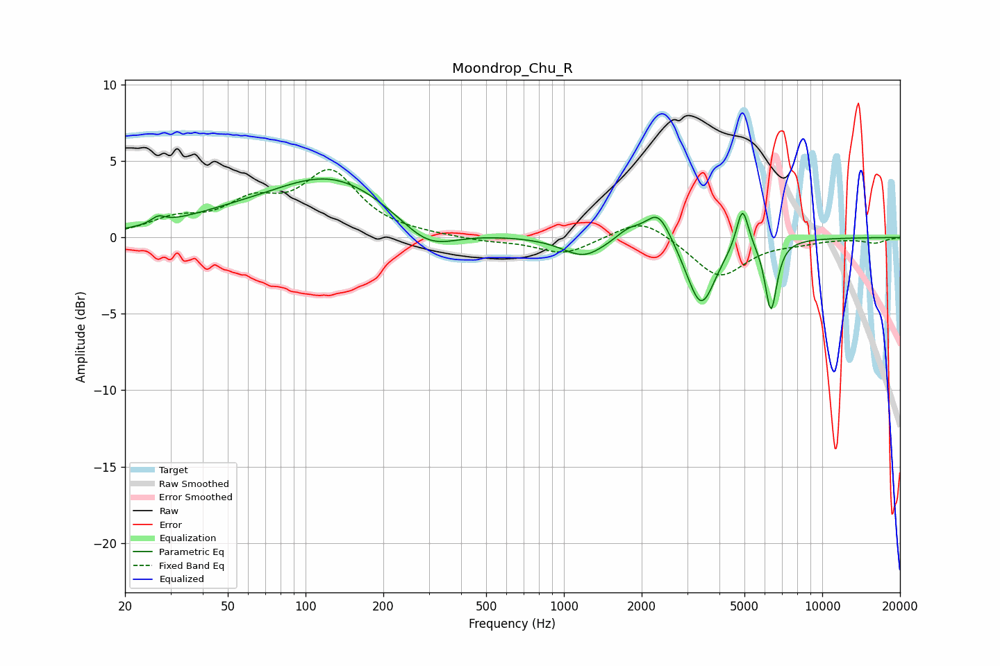

# Moondrop_Chu_R
See [usage instructions](https://github.com/jaakkopasanen/AutoEq#usage) for more options and info.

### Parametric EQs
Apply preamp of -3.9 dB when using parametric equalizer.

|   # | Type    |   Fc (Hz) |    Q |   Gain (dB) |
|-----|---------|-----------|------|-------------|
|   1 | Peaking |        27 | 5.4  |         0.5 |
|   2 | Peaking |        51 | 0.6  |         0.9 |
|   3 | Peaking |       128 | 0.61 |         3.7 |
|   4 | Peaking |       297 | 1.29 |        -1.7 |
|   5 | Peaking |      1192 | 1.75 |        -1.3 |
|   6 | Peaking |      1783 | 2.77 |         0.7 |
|   7 | Peaking |      2323 | 2.83 |         2.1 |
|   8 | Peaking |      3396 | 2.54 |        -4.5 |
|   9 | Peaking |      4911 | 6    |         2.8 |
|  10 | Peaking |      6333 | 5.97 |        -4.6 |

### Fixed Band EQs
When using fixed band (also called graphic) equalizer, apply preamp of **-4.5 dB** (if available) and set gains manually with these parameters.

|   # | Type    |   Fc (Hz) |    Q |   Gain (dB) |
|-----|---------|-----------|------|-------------|
|   1 | Peaking |        31 | 1.41 |         1   |
|   2 | Peaking |        62 | 1.41 |         1.9 |
|   3 | Peaking |       125 | 1.41 |         4   |
|   4 | Peaking |       250 | 1.41 |         0.1 |
|   5 | Peaking |       500 | 1.41 |        -0.2 |
|   6 | Peaking |      1000 | 1.41 |        -1.1 |
|   7 | Peaking |      2000 | 1.41 |         1.4 |
|   8 | Peaking |      4000 | 1.41 |        -2.6 |
|   9 | Peaking |      8000 | 1.41 |        -0.2 |
|  10 | Peaking |     16000 | 1.41 |        -0.3 |

### Graphs

