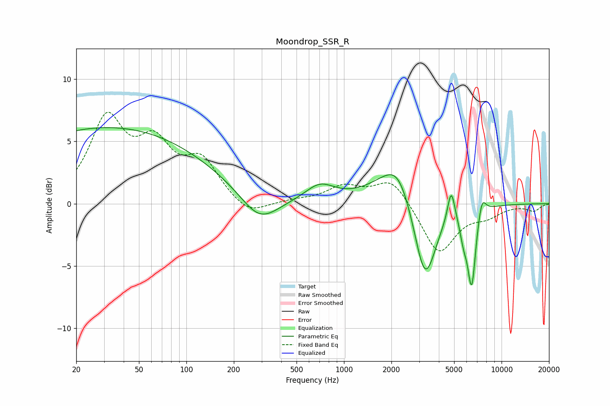

# Moondrop_SSR_R
See [usage instructions](https://github.com/jaakkopasanen/AutoEq#usage) for more options and info.

### Parametric EQs
Apply preamp of -6.2 dB when using parametric equalizer.

|   # | Type    |   Fc (Hz) |    Q |   Gain (dB) |
|-----|---------|-----------|------|-------------|
|   1 | Peaking |        32 | 0.21 |         6.1 |
|   2 | Peaking |       291 | 1.17 |        -2.3 |
|   3 | Peaking |       703 | 1.52 |         1.3 |
|   4 | Peaking |      2047 | 0.94 |         2.2 |
|   5 | Peaking |      2214 | 1.82 |         1.6 |
|   6 | Peaking |      3267 | 1.98 |        -6.9 |
|   7 | Peaking |      4792 | 6    |         2.6 |
|   8 | Peaking |      5742 | 5.68 |        -1.6 |
|   9 | Peaking |      6462 | 5.3  |        -6.2 |
|  10 | Peaking |      7505 | 5.42 |         1.6 |

### Fixed Band EQs
When using fixed band (also called graphic) equalizer, apply preamp of **-7.4 dB** (if available) and set gains manually with these parameters.

|   # | Type    |   Fc (Hz) |    Q |   Gain (dB) |
|-----|---------|-----------|------|-------------|
|   1 | Peaking |        31 | 1.41 |         6.5 |
|   2 | Peaking |        62 | 1.41 |         4.1 |
|   3 | Peaking |       125 | 1.41 |         3.1 |
|   4 | Peaking |       250 | 1.41 |        -1.1 |
|   5 | Peaking |       500 | 1.41 |         0.2 |
|   6 | Peaking |      1000 | 1.41 |         1.3 |
|   7 | Peaking |      2000 | 1.41 |         2.1 |
|   8 | Peaking |      4000 | 1.41 |        -4.1 |
|   9 | Peaking |      8000 | 1.41 |        -0.8 |
|  10 | Peaking |     16000 | 1.41 |        -0.5 |

### Graphs

