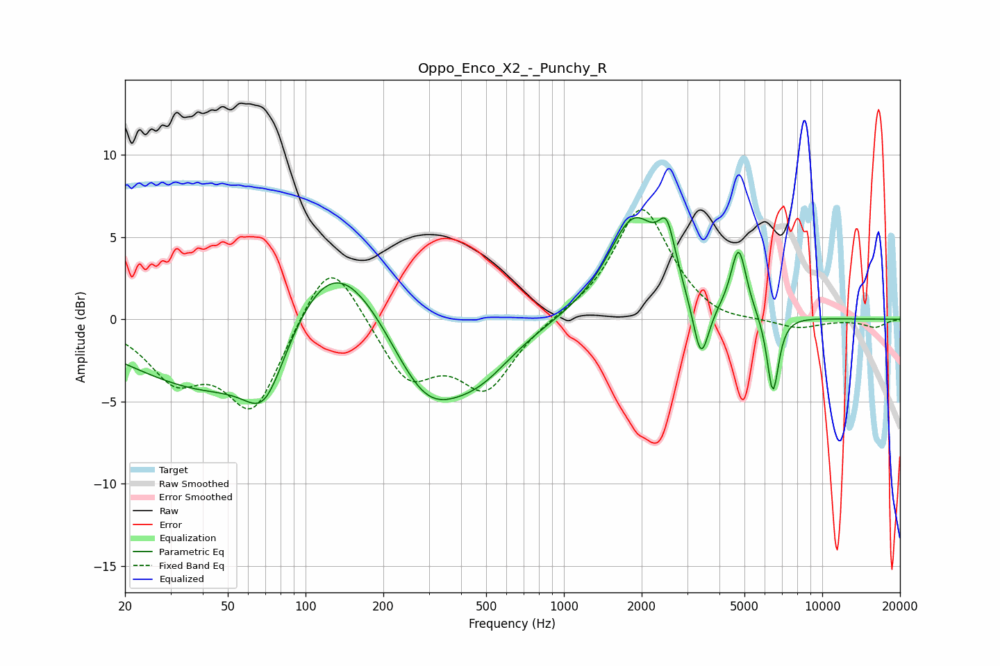

# Oppo_Enco_X2_-_Punchy_R
See [usage instructions](https://github.com/jaakkopasanen/AutoEq#usage) for more options and info.

### Parametric EQs
Apply preamp of -6.3 dB when using parametric equalizer.

|   # | Type    |   Fc (Hz) |    Q |   Gain (dB) |
|-----|---------|-----------|------|-------------|
|   1 | Peaking |        52 | 0.41 |        -5.5 |
|   2 | Peaking |        70 | 1.8  |        -3.6 |
|   3 | Peaking |       126 | 0.67 |         7.4 |
|   4 | Peaking |       292 | 0.96 |        -5.4 |
|   5 | Peaking |       476 | 1.06 |        -2.3 |
|   6 | Peaking |      1866 | 1.38 |         6.1 |
|   7 | Peaking |      2506 | 4.36 |         2.9 |
|   8 | Peaking |      3392 | 4.51 |        -3.8 |
|   9 | Peaking |      4747 | 4.66 |         4   |
|  10 | Peaking |      6441 | 6    |        -4.8 |

### Fixed Band EQs
When using fixed band (also called graphic) equalizer, apply preamp of **-6.8 dB** (if available) and set gains manually with these parameters.

|   # | Type    |   Fc (Hz) |    Q |   Gain (dB) |
|-----|---------|-----------|------|-------------|
|   1 | Peaking |        31 | 1.41 |        -3.2 |
|   2 | Peaking |        62 | 1.41 |        -5.5 |
|   3 | Peaking |       125 | 1.41 |         4.4 |
|   4 | Peaking |       250 | 1.41 |        -3.6 |
|   5 | Peaking |       500 | 1.41 |        -4.1 |
|   6 | Peaking |      1000 | 1.41 |         0.1 |
|   7 | Peaking |      2000 | 1.41 |         6.9 |
|   8 | Peaking |      4000 | 1.41 |        -0.5 |
|   9 | Peaking |      8000 | 1.41 |        -0.6 |
|  10 | Peaking |     16000 | 1.41 |        -0.5 |

### Graphs

