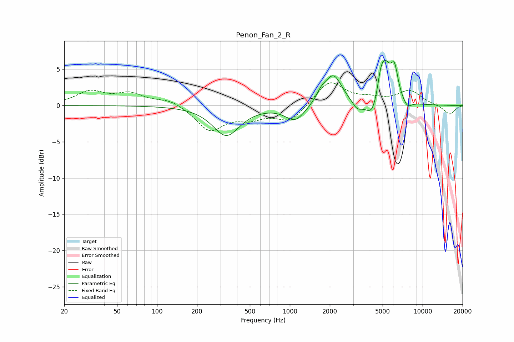

# Penon_Fan_2_R
See [usage instructions](https://github.com/jaakkopasanen/AutoEq#usage) for more options and info.

### Parametric EQs
Apply preamp of -6.3 dB when using parametric equalizer.

|   # | Type    |   Fc (Hz) |    Q |   Gain (dB) |
|-----|---------|-----------|------|-------------|
|   1 | Peaking |       332 | 1.41 |        -4.1 |
|   2 | Peaking |      1099 | 1.92 |        -2.2 |
|   3 | Peaking |      1730 | 3.66 |         1.1 |
|   4 | Peaking |      2133 | 2.2  |         4.1 |
|   5 | Peaking |      3211 | 3.91 |        -1.1 |
|   6 | Peaking |      4245 | 2.63 |        -3.4 |
|   7 | Peaking |      4819 | 6    |         1.6 |
|   8 | Peaking |      5162 | 2.7  |         6.1 |
|   9 | Peaking |      6144 | 5.23 |         3.6 |
|  10 | Peaking |      7662 | 4.06 |        -1.1 |

### Fixed Band EQs
When using fixed band (also called graphic) equalizer, apply preamp of **-3.2 dB** (if available) and set gains manually with these parameters.

|   # | Type    |   Fc (Hz) |    Q |   Gain (dB) |
|-----|---------|-----------|------|-------------|
|   1 | Peaking |        31 | 1.41 |         1.8 |
|   2 | Peaking |        62 | 1.41 |         1.5 |
|   3 | Peaking |       125 | 1.41 |         0.9 |
|   4 | Peaking |       250 | 1.41 |        -3.4 |
|   5 | Peaking |       500 | 1.41 |        -1.4 |
|   6 | Peaking |      1000 | 1.41 |        -2.2 |
|   7 | Peaking |      2000 | 1.41 |         3.4 |
|   8 | Peaking |      4000 | 1.41 |         0.7 |
|   9 | Peaking |      8000 | 1.41 |         2   |
|  10 | Peaking |     16000 | 1.41 |        -1.3 |

### Graphs

