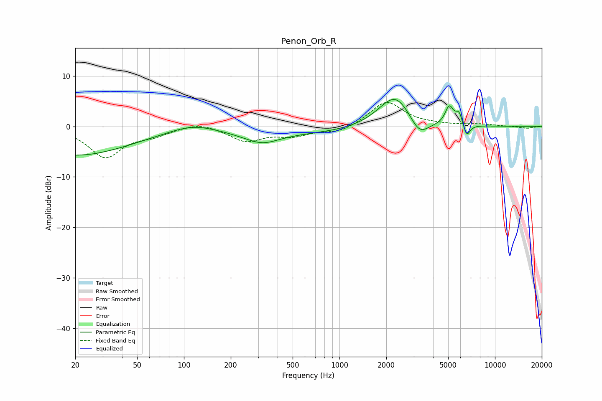

# Penon_Orb_R
See [usage instructions](https://github.com/jaakkopasanen/AutoEq#usage) for more options and info.

### Parametric EQs
Apply preamp of -5.4 dB when using parametric equalizer.

|   # | Type    |   Fc (Hz) |    Q |   Gain (dB) |
|-----|---------|-----------|------|-------------|
|   1 | Peaking |        20 | 0.4  |        -5.7 |
|   2 | Peaking |       114 | 0.89 |         1.9 |
|   3 | Peaking |       203 | 2.36 |        -0   |
|   4 | Peaking |       317 | 1.3  |        -2.1 |
|   5 | Peaking |       511 | 0.18 |        -1.4 |
|   6 | Peaking |      2293 | 1.25 |         7.2 |
|   7 | Peaking |      3254 | 2.23 |        -3.8 |
|   8 | Peaking |      5082 | 5.35 |         3.6 |
|   9 | Peaking |      5887 | 5.99 |         2.6 |
|  10 | Peaking |      6560 | 6    |        -2.7 |

### Fixed Band EQs
When using fixed band (also called graphic) equalizer, apply preamp of **-4.8 dB** (if available) and set gains manually with these parameters.

|   # | Type    |   Fc (Hz) |    Q |   Gain (dB) |
|-----|---------|-----------|------|-------------|
|   1 | Peaking |        31 | 1.41 |        -6   |
|   2 | Peaking |        62 | 1.41 |        -1.4 |
|   3 | Peaking |       125 | 1.41 |         1   |
|   4 | Peaking |       250 | 1.41 |        -2.8 |
|   5 | Peaking |       500 | 1.41 |        -1.6 |
|   6 | Peaking |      1000 | 1.41 |        -1.3 |
|   7 | Peaking |      2000 | 1.41 |         5   |
|   8 | Peaking |      4000 | 1.41 |         0.2 |
|   9 | Peaking |      8000 | 1.41 |         0.4 |
|  10 | Peaking |     16000 | 1.41 |        -0.4 |

### Graphs

