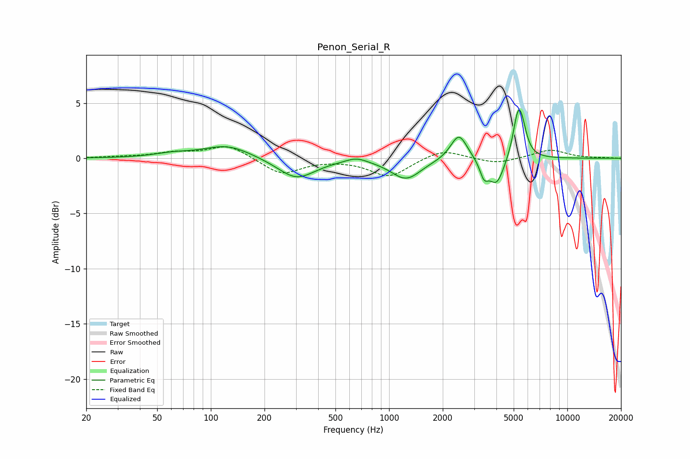

# Penon_Serial_R
See [usage instructions](https://github.com/jaakkopasanen/AutoEq#usage) for more options and info.

### Parametric EQs
Apply preamp of -4.5 dB when using parametric equalizer.

|   # | Type    |   Fc (Hz) |    Q |   Gain (dB) |
|-----|---------|-----------|------|-------------|
|   1 | Peaking |        61 | 1.38 |         0.3 |
|   2 | Peaking |       124 | 1.06 |         1.2 |
|   3 | Peaking |       302 | 1.36 |        -1.9 |
|   4 | Peaking |       655 | 2.47 |         0.5 |
|   5 | Peaking |      1245 | 1.69 |        -1.9 |
|   6 | Peaking |      2464 | 3.07 |         2.4 |
|   7 | Peaking |      3409 | 5.99 |        -1.4 |
|   8 | Peaking |      4008 | 3.26 |        -2.5 |
|   9 | Peaking |      5291 | 4.93 |         3.9 |
|  10 | Peaking |      5608 | 5.51 |         1.4 |

### Fixed Band EQs
When using fixed band (also called graphic) equalizer, apply preamp of **-1.1 dB** (if available) and set gains manually with these parameters.

|   # | Type    |   Fc (Hz) |    Q |   Gain (dB) |
|-----|---------|-----------|------|-------------|
|   1 | Peaking |        31 | 1.41 |         0.1 |
|   2 | Peaking |        62 | 1.41 |         0.5 |
|   3 | Peaking |       125 | 1.41 |         1.2 |
|   4 | Peaking |       250 | 1.41 |        -1.5 |
|   5 | Peaking |       500 | 1.41 |        -0   |
|   6 | Peaking |      1000 | 1.41 |        -1.7 |
|   7 | Peaking |      2000 | 1.41 |         0.9 |
|   8 | Peaking |      4000 | 1.41 |        -0.5 |
|   9 | Peaking |      8000 | 1.41 |         0.8 |
|  10 | Peaking |     16000 | 1.41 |         0   |

### Graphs

