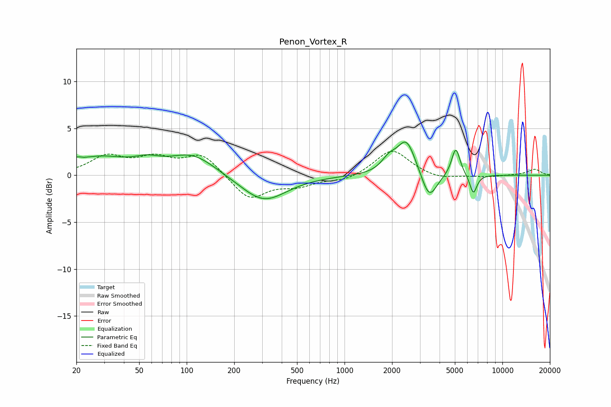

# Penon_Vortex_R
See [usage instructions](https://github.com/jaakkopasanen/AutoEq#usage) for more options and info.

### Parametric EQs
Apply preamp of -3.6 dB when using parametric equalizer.

|   # | Type    |   Fc (Hz) |    Q |   Gain (dB) |
|-----|---------|-----------|------|-------------|
|   1 | Peaking |        20 | 5    |         0.4 |
|   2 | Peaking |        28 | 0.79 |         1.8 |
|   3 | Peaking |        56 | 1.7  |         0.8 |
|   4 | Peaking |       109 | 0.97 |         2.2 |
|   5 | Peaking |       307 | 0.98 |        -2.9 |
|   6 | Peaking |      1912 | 2.99 |         1.2 |
|   7 | Peaking |      2469 | 2.41 |         3.7 |
|   8 | Peaking |      3436 | 2.89 |        -3   |
|   9 | Peaking |      5069 | 5.2  |         3   |
|  10 | Peaking |      6548 | 6    |        -2.1 |

### Fixed Band EQs
When using fixed band (also called graphic) equalizer, apply preamp of **-2.6 dB** (if available) and set gains manually with these parameters.

|   # | Type    |   Fc (Hz) |    Q |   Gain (dB) |
|-----|---------|-----------|------|-------------|
|   1 | Peaking |        31 | 1.41 |         1.9 |
|   2 | Peaking |        62 | 1.41 |         1.6 |
|   3 | Peaking |       125 | 1.41 |         2.2 |
|   4 | Peaking |       250 | 1.41 |        -2.6 |
|   5 | Peaking |       500 | 1.41 |        -1   |
|   6 | Peaking |      1000 | 1.41 |        -0.6 |
|   7 | Peaking |      2000 | 1.41 |         2.8 |
|   8 | Peaking |      4000 | 1.41 |        -0.5 |
|   9 | Peaking |      8000 | 1.41 |        -0.2 |
|  10 | Peaking |     16000 | 1.41 |         0.6 |

### Graphs

