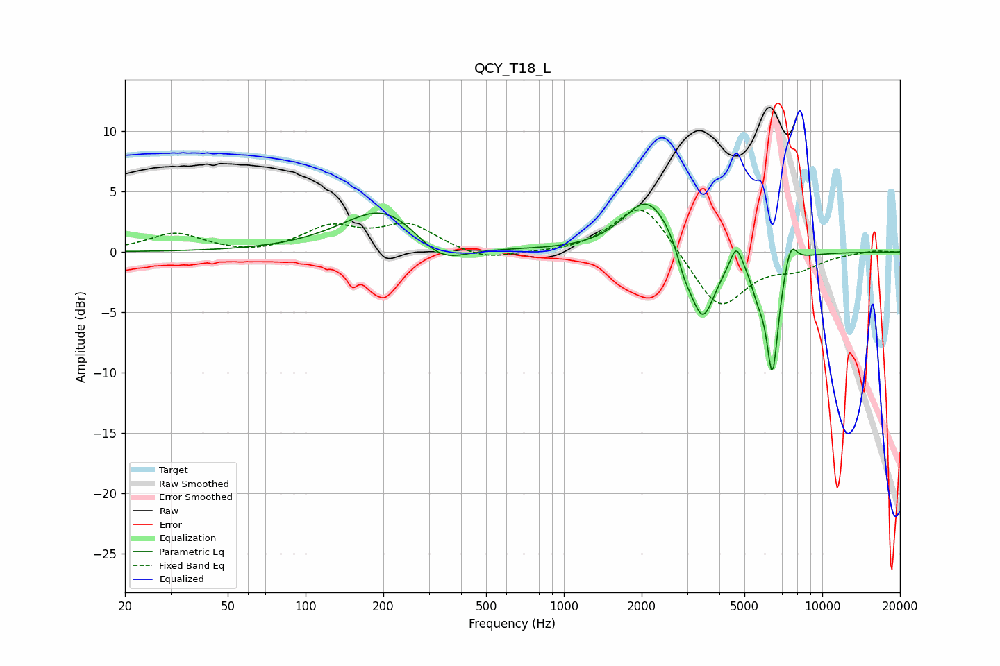

# QCY_T18_L
See [usage instructions](https://github.com/jaakkopasanen/AutoEq#usage) for more options and info.

### Parametric EQs
Apply preamp of -4.1 dB when using parametric equalizer.

|   # | Type    |   Fc (Hz) |    Q |   Gain (dB) |
|-----|---------|-----------|------|-------------|
|   1 | Peaking |       204 | 0.87 |         3.9 |
|   2 | Peaking |       330 | 1.37 |        -2.3 |
|   3 | Peaking |      2074 | 1.57 |         3.9 |
|   4 | Peaking |      2520 | 1.5  |         1.2 |
|   5 | Peaking |      2922 | 4.94 |        -1.4 |
|   6 | Peaking |      3433 | 2.72 |        -6.3 |
|   7 | Peaking |      4649 | 6    |         2   |
|   8 | Peaking |      5624 | 5.14 |        -1.9 |
|   9 | Peaking |      6415 | 5.64 |        -9.6 |
|  10 | Peaking |      7550 | 5.76 |         2.1 |

### Fixed Band EQs
When using fixed band (also called graphic) equalizer, apply preamp of **-3.6 dB** (if available) and set gains manually with these parameters.

|   # | Type    |   Fc (Hz) |    Q |   Gain (dB) |
|-----|---------|-----------|------|-------------|
|   1 | Peaking |        31 | 1.41 |         1.5 |
|   2 | Peaking |        62 | 1.41 |        -0.3 |
|   3 | Peaking |       125 | 1.41 |         1.9 |
|   4 | Peaking |       250 | 1.41 |         2.1 |
|   5 | Peaking |       500 | 1.41 |        -0.8 |
|   6 | Peaking |      1000 | 1.41 |        -0.1 |
|   7 | Peaking |      2000 | 1.41 |         4.4 |
|   8 | Peaking |      4000 | 1.41 |        -4.9 |
|   9 | Peaking |      8000 | 1.41 |        -1.1 |
|  10 | Peaking |     16000 | 1.41 |         0.2 |

### Graphs

