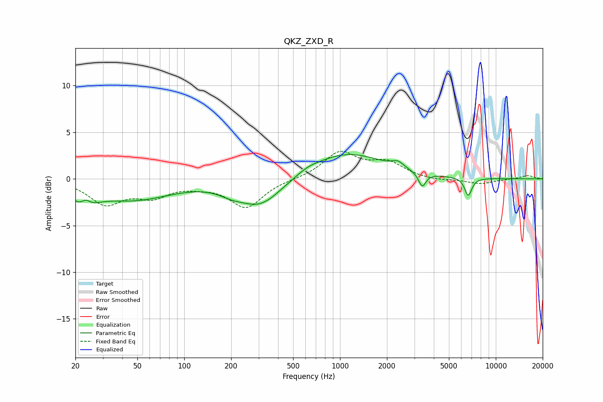

# QKZ_ZXD_R
See [usage instructions](https://github.com/jaakkopasanen/AutoEq#usage) for more options and info.

### Parametric EQs
Apply preamp of -2.7 dB when using parametric equalizer.

|   # | Type    |   Fc (Hz) |    Q |   Gain (dB) |
|-----|---------|-----------|------|-------------|
|   1 | Peaking |        23 | 2    |        -2.3 |
|   2 | Peaking |        23 | 4.21 |         1.2 |
|   3 | Peaking |        47 | 0.57 |        -2.1 |
|   4 | Peaking |       200 | 1.82 |        -0.6 |
|   5 | Peaking |       308 | 1.01 |        -3   |
|   6 | Peaking |       622 | 2.27 |         0.3 |
|   7 | Peaking |      1092 | 0.58 |         2.8 |
|   8 | Peaking |      2352 | 3.82 |         0.6 |
|   9 | Peaking |      3369 | 5.99 |        -1.5 |
|  10 | Peaking |      6657 | 6    |        -1.9 |

### Fixed Band EQs
When using fixed band (also called graphic) equalizer, apply preamp of **-3.1 dB** (if available) and set gains manually with these parameters.

|   # | Type    |   Fc (Hz) |    Q |   Gain (dB) |
|-----|---------|-----------|------|-------------|
|   1 | Peaking |        31 | 1.41 |        -2.5 |
|   2 | Peaking |        62 | 1.41 |        -1.6 |
|   3 | Peaking |       125 | 1.41 |        -0.5 |
|   4 | Peaking |       250 | 1.41 |        -3   |
|   5 | Peaking |       500 | 1.41 |        -0   |
|   6 | Peaking |      1000 | 1.41 |         2.8 |
|   7 | Peaking |      2000 | 1.41 |         1.6 |
|   8 | Peaking |      4000 | 1.41 |        -0.2 |
|   9 | Peaking |      8000 | 1.41 |        -0.5 |
|  10 | Peaking |     16000 | 1.41 |         0.4 |

### Graphs

