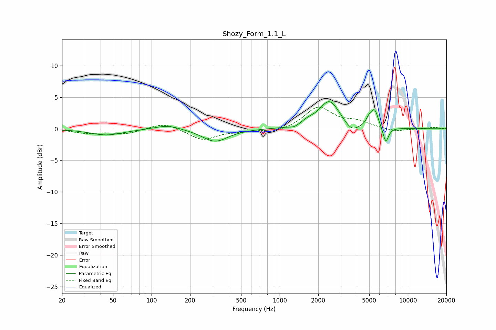

# Shozy_Form_1.1_L
See [usage instructions](https://github.com/jaakkopasanen/AutoEq#usage) for more options and info.

### Parametric EQs
Apply preamp of -4.4 dB when using parametric equalizer.

|   # | Type    |   Fc (Hz) |    Q |   Gain (dB) |
|-----|---------|-----------|------|-------------|
|   1 | Peaking |        44 | 1.09 |        -1   |
|   2 | Peaking |       133 | 1.47 |         0.7 |
|   3 | Peaking |       314 | 1.42 |        -2   |
|   4 | Peaking |      1303 | 3.75 |        -0.4 |
|   5 | Peaking |      1656 | 2.62 |         0.6 |
|   6 | Peaking |      2447 | 1.8  |         4.4 |
|   7 | Peaking |      3636 | 2.64 |        -1.3 |
|   8 | Peaking |      4994 | 6    |         1   |
|   9 | Peaking |      5512 | 4.72 |         2.7 |
|  10 | Peaking |      6727 | 6    |        -2.5 |

### Fixed Band EQs
When using fixed band (also called graphic) equalizer, apply preamp of **-3.5 dB** (if available) and set gains manually with these parameters.

|   # | Type    |   Fc (Hz) |    Q |   Gain (dB) |
|-----|---------|-----------|------|-------------|
|   1 | Peaking |        31 | 1.41 |        -0.6 |
|   2 | Peaking |        62 | 1.41 |        -0.8 |
|   3 | Peaking |       125 | 1.41 |         1   |
|   4 | Peaking |       250 | 1.41 |        -1.8 |
|   5 | Peaking |       500 | 1.41 |        -0.3 |
|   6 | Peaking |      1000 | 1.41 |        -0.6 |
|   7 | Peaking |      2000 | 1.41 |         3.4 |
|   8 | Peaking |      4000 | 1.41 |         1   |
|   9 | Peaking |      8000 | 1.41 |        -0.5 |
|  10 | Peaking |     16000 | 1.41 |         0.2 |

### Graphs

