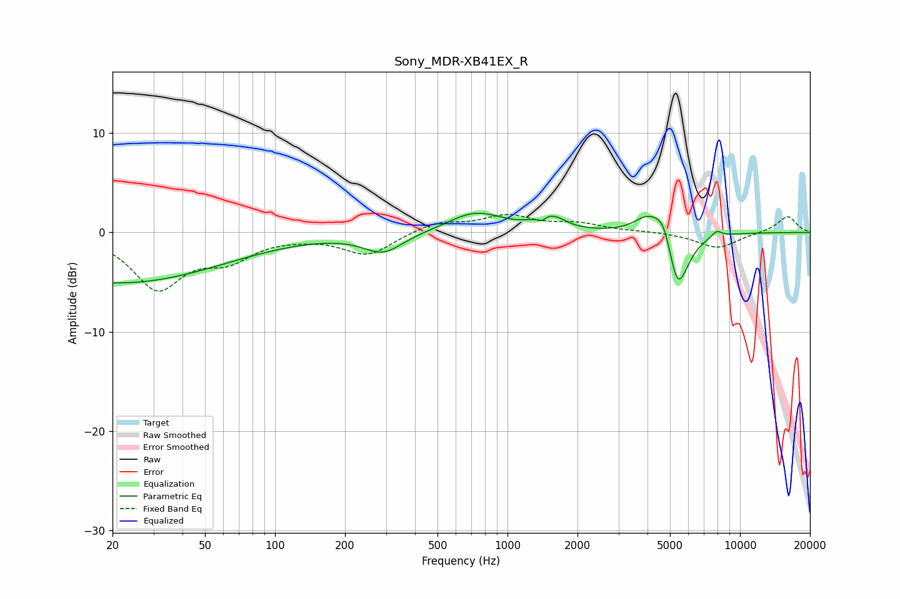

# Sony_MDR-XB41EX_R
See [usage instructions](https://github.com/jaakkopasanen/AutoEq#usage) for more options and info.

### Parametric EQs
Apply preamp of -2.0 dB when using parametric equalizer.

|   # | Type    |   Fc (Hz) |    Q |   Gain (dB) |
|-----|---------|-----------|------|-------------|
|   1 | Peaking |        21 | 0.31 |        -5.1 |
|   2 | Peaking |       292 | 1.67 |        -2   |
|   3 | Peaking |       729 | 1.2  |         2   |
|   4 | Peaking |      1420 | 5.8  |        -1.2 |
|   5 | Peaking |      1502 | 3.08 |         2.5 |
|   6 | Peaking |      1556 | 5.99 |        -0.6 |
|   7 | Peaking |      3996 | 2.37 |         1.8 |
|   8 | Peaking |      4739 | 3.32 |         3.3 |
|   9 | Peaking |      5361 | 2.91 |        -6.9 |
|  10 | Peaking |      7936 | 5.99 |         0.6 |

### Fixed Band EQs
When using fixed band (also called graphic) equalizer, apply preamp of **-1.9 dB** (if available) and set gains manually with these parameters.

|   # | Type    |   Fc (Hz) |    Q |   Gain (dB) |
|-----|---------|-----------|------|-------------|
|   1 | Peaking |        31 | 1.41 |        -5.4 |
|   2 | Peaking |        62 | 1.41 |        -2.3 |
|   3 | Peaking |       125 | 1.41 |        -0.2 |
|   4 | Peaking |       250 | 1.41 |        -2.3 |
|   5 | Peaking |       500 | 1.41 |         1.1 |
|   6 | Peaking |      1000 | 1.41 |         1.6 |
|   7 | Peaking |      2000 | 1.41 |         0.8 |
|   8 | Peaking |      4000 | 1.41 |         0.1 |
|   9 | Peaking |      8000 | 1.41 |        -1.6 |
|  10 | Peaking |     16000 | 1.41 |         1.7 |

### Graphs

