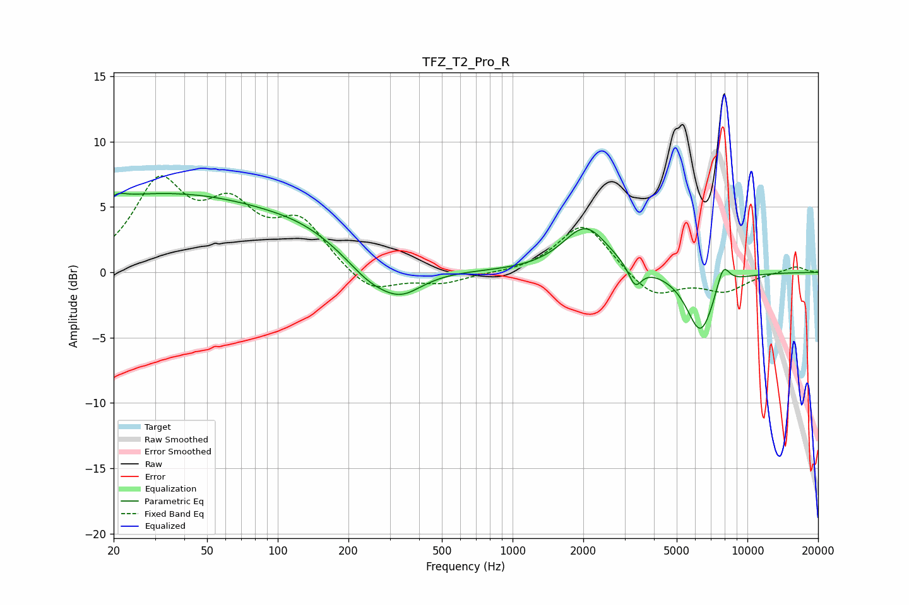

# TFZ_T2_Pro_R
See [usage instructions](https://github.com/jaakkopasanen/AutoEq#usage) for more options and info.

### Parametric EQs
Apply preamp of -6.1 dB when using parametric equalizer.

|   # | Type    |   Fc (Hz) |    Q |   Gain (dB) |
|-----|---------|-----------|------|-------------|
|   1 | Peaking |        20 | 5.97 |        -3.2 |
|   2 | Peaking |        20 | 5.48 |         3.5 |
|   3 | Peaking |        33 | 0.23 |         6   |
|   4 | Peaking |       129 | 0.97 |         0.6 |
|   5 | Peaking |       244 | 1.41 |        -1.4 |
|   6 | Peaking |       334 | 1.46 |        -2   |
|   7 | Peaking |      2045 | 1.48 |         3.5 |
|   8 | Peaking |      3322 | 5.04 |        -1.6 |
|   9 | Peaking |      6319 | 2.31 |        -4.7 |
|  10 | Peaking |      7878 | 4.68 |         1.9 |

### Fixed Band EQs
When using fixed band (also called graphic) equalizer, apply preamp of **-7.5 dB** (if available) and set gains manually with these parameters.

|   # | Type    |   Fc (Hz) |    Q |   Gain (dB) |
|-----|---------|-----------|------|-------------|
|   1 | Peaking |        31 | 1.41 |         6.5 |
|   2 | Peaking |        62 | 1.41 |         4.2 |
|   3 | Peaking |       125 | 1.41 |         3.6 |
|   4 | Peaking |       250 | 1.41 |        -1.7 |
|   5 | Peaking |       500 | 1.41 |        -0.8 |
|   6 | Peaking |      1000 | 1.41 |        -0.1 |
|   7 | Peaking |      2000 | 1.41 |         3.9 |
|   8 | Peaking |      4000 | 1.41 |        -2   |
|   9 | Peaking |      8000 | 1.41 |        -1.4 |
|  10 | Peaking |     16000 | 1.41 |         0.5 |

### Graphs

