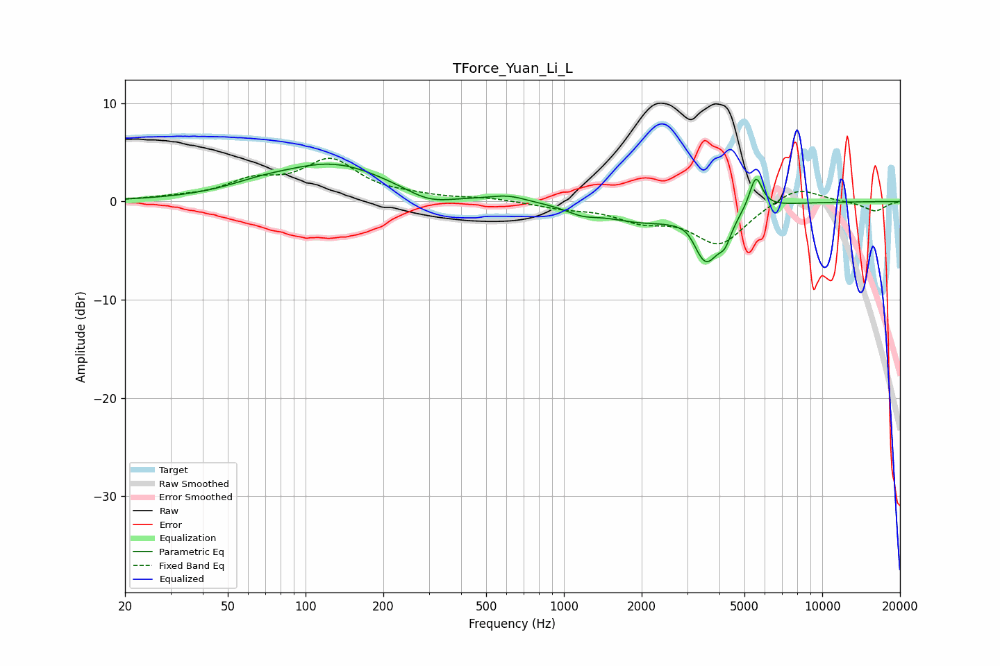

# TForce_Yuan_Li_L
See [usage instructions](https://github.com/jaakkopasanen/AutoEq#usage) for more options and info.

### Parametric EQs
Apply preamp of -3.9 dB when using parametric equalizer.

|   # | Type    |   Fc (Hz) |    Q |   Gain (dB) |
|-----|---------|-----------|------|-------------|
|   1 | Peaking |        66 | 1.13 |         0.7 |
|   2 | Peaking |       129 | 0.66 |         3.7 |
|   3 | Peaking |       300 | 1.53 |        -1.1 |
|   4 | Peaking |       609 | 2.01 |         0.6 |
|   5 | Peaking |      1177 | 2.19 |        -0.8 |
|   6 | Peaking |      1934 | 1.03 |        -1.6 |
|   7 | Peaking |      3091 | 3.03 |         1.4 |
|   8 | Peaking |      3517 | 2.38 |        -6.2 |
|   9 | Peaking |      4208 | 6    |        -1.6 |
|  10 | Peaking |      5531 | 5.54 |         3.5 |

### Fixed Band EQs
When using fixed band (also called graphic) equalizer, apply preamp of **-4.5 dB** (if available) and set gains manually with these parameters.

|   # | Type    |   Fc (Hz) |    Q |   Gain (dB) |
|-----|---------|-----------|------|-------------|
|   1 | Peaking |        31 | 1.41 |         0.3 |
|   2 | Peaking |        62 | 1.41 |         1.8 |
|   3 | Peaking |       125 | 1.41 |         4   |
|   4 | Peaking |       250 | 1.41 |         0.4 |
|   5 | Peaking |       500 | 1.41 |         0.3 |
|   6 | Peaking |      1000 | 1.41 |        -0.6 |
|   7 | Peaking |      2000 | 1.41 |        -1.6 |
|   8 | Peaking |      4000 | 1.41 |        -4.2 |
|   9 | Peaking |      8000 | 1.41 |         1.7 |
|  10 | Peaking |     16000 | 1.41 |        -1   |

### Graphs

