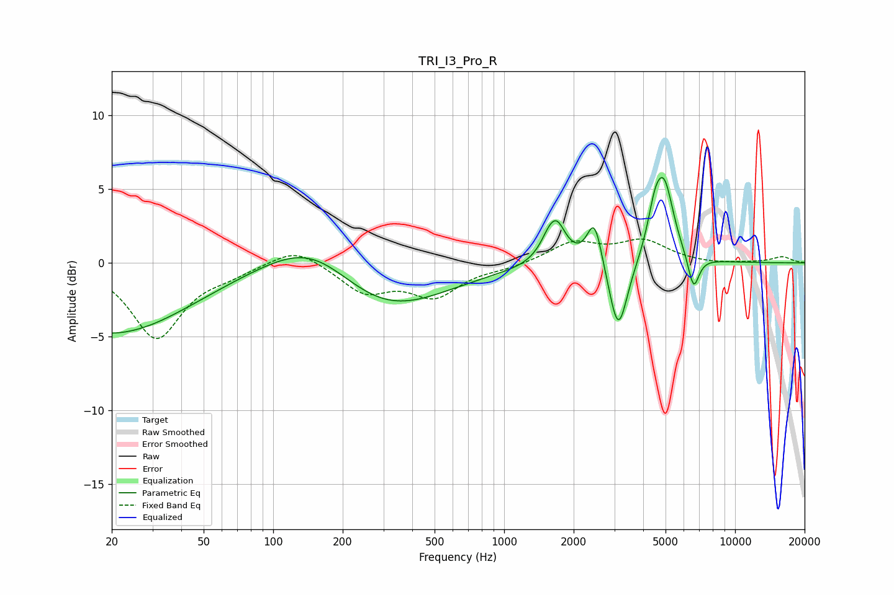

# TRI_I3_Pro_R
See [usage instructions](https://github.com/jaakkopasanen/AutoEq#usage) for more options and info.

### Parametric EQs
Apply preamp of -5.9 dB when using parametric equalizer.

|   # | Type    |   Fc (Hz) |    Q |   Gain (dB) |
|-----|---------|-----------|------|-------------|
|   1 | Peaking |        20 | 0.42 |        -4.8 |
|   2 | Peaking |       150 | 0.71 |         3   |
|   3 | Peaking |       291 | 0.54 |        -3.7 |
|   4 | Peaking |      1632 | 5.99 |        -0.5 |
|   5 | Peaking |      1648 | 3.3  |         3.6 |
|   6 | Peaking |      2463 | 4.36 |         3.1 |
|   7 | Peaking |      3121 | 3.52 |        -5.1 |
|   8 | Peaking |      4482 | 4.54 |         2.2 |
|   9 | Peaking |      4937 | 3.33 |         5   |
|  10 | Peaking |      6611 | 5.71 |        -2.3 |

### Fixed Band EQs
When using fixed band (also called graphic) equalizer, apply preamp of **-1.7 dB** (if available) and set gains manually with these parameters.

|   # | Type    |   Fc (Hz) |    Q |   Gain (dB) |
|-----|---------|-----------|------|-------------|
|   1 | Peaking |        31 | 1.41 |        -5.1 |
|   2 | Peaking |        62 | 1.41 |        -0.6 |
|   3 | Peaking |       125 | 1.41 |         1.2 |
|   4 | Peaking |       250 | 1.41 |        -1.9 |
|   5 | Peaking |       500 | 1.41 |        -2.1 |
|   6 | Peaking |      1000 | 1.41 |        -0.3 |
|   7 | Peaking |      2000 | 1.41 |         1.4 |
|   8 | Peaking |      4000 | 1.41 |         1.4 |
|   9 | Peaking |      8000 | 1.41 |        -0.1 |
|  10 | Peaking |     16000 | 1.41 |         0.4 |

### Graphs

