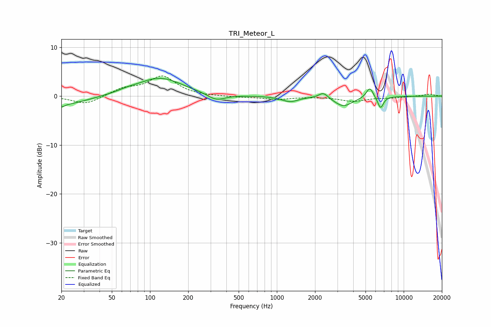

# TRI_Meteor_L
See [usage instructions](https://github.com/jaakkopasanen/AutoEq#usage) for more options and info.

### Parametric EQs
Apply preamp of -3.7 dB when using parametric equalizer.

|   # | Type    |   Fc (Hz) |    Q |   Gain (dB) |
|-----|---------|-----------|------|-------------|
|   1 | Peaking |        20 | 5.38 |        -0.7 |
|   2 | Peaking |        22 | 0.8  |        -1.7 |
|   3 | Peaking |        66 | 1.95 |         0.3 |
|   4 | Peaking |       119 | 0.79 |         3.7 |
|   5 | Peaking |       332 | 2.06 |        -1.4 |
|   6 | Peaking |      1269 | 2.18 |        -1.1 |
|   7 | Peaking |      2330 | 3.86 |         1.2 |
|   8 | Peaking |      3347 | 1.94 |        -2.1 |
|   9 | Peaking |      5402 | 5.22 |         2.2 |
|  10 | Peaking |      6569 | 6    |        -2.4 |

### Fixed Band EQs
When using fixed band (also called graphic) equalizer, apply preamp of **-4.2 dB** (if available) and set gains manually with these parameters.

|   # | Type    |   Fc (Hz) |    Q |   Gain (dB) |
|-----|---------|-----------|------|-------------|
|   1 | Peaking |        31 | 1.41 |        -1.7 |
|   2 | Peaking |        62 | 1.41 |         1.4 |
|   3 | Peaking |       125 | 1.41 |         3.9 |
|   4 | Peaking |       250 | 1.41 |        -0.1 |
|   5 | Peaking |       500 | 1.41 |        -0.2 |
|   6 | Peaking |      1000 | 1.41 |        -0.6 |
|   7 | Peaking |      2000 | 1.41 |        -0.1 |
|   8 | Peaking |      4000 | 1.41 |        -1   |
|   9 | Peaking |      8000 | 1.41 |        -0.3 |
|  10 | Peaking |     16000 | 1.41 |         0.4 |

### Graphs

