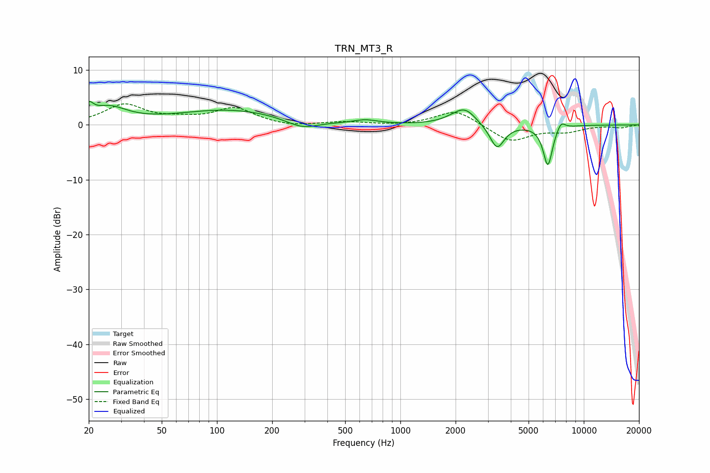

# TRN_MT3_R
See [usage instructions](https://github.com/jaakkopasanen/AutoEq#usage) for more options and info.

### Parametric EQs
Apply preamp of -4.4 dB when using parametric equalizer.

|   # | Type    |   Fc (Hz) |    Q |   Gain (dB) |
|-----|---------|-----------|------|-------------|
|   1 | Peaking |        20 | 5.9  |         2.1 |
|   2 | Peaking |        26 | 1.45 |         2.8 |
|   3 | Peaking |       117 | 0.49 |         2.7 |
|   4 | Peaking |       291 | 1.59 |        -1.7 |
|   5 | Peaking |       645 | 2.17 |         0.7 |
|   6 | Peaking |      1960 | 2.11 |         0.7 |
|   7 | Peaking |      2263 | 2.4  |         2.6 |
|   8 | Peaking |      3367 | 3.56 |        -4.5 |
|   9 | Peaking |      6369 | 5.29 |        -7.4 |
|  10 | Peaking |      7508 | 5.9  |         1.5 |

### Fixed Band EQs
When using fixed band (also called graphic) equalizer, apply preamp of **-3.9 dB** (if available) and set gains manually with these parameters.

|   # | Type    |   Fc (Hz) |    Q |   Gain (dB) |
|-----|---------|-----------|------|-------------|
|   1 | Peaking |        31 | 1.41 |         3.6 |
|   2 | Peaking |        62 | 1.41 |         0.8 |
|   3 | Peaking |       125 | 1.41 |         2.9 |
|   4 | Peaking |       250 | 1.41 |        -0.4 |
|   5 | Peaking |       500 | 1.41 |         0.5 |
|   6 | Peaking |      1000 | 1.41 |        -0.2 |
|   7 | Peaking |      2000 | 1.41 |         2.8 |
|   8 | Peaking |      4000 | 1.41 |        -3.1 |
|   9 | Peaking |      8000 | 1.41 |        -1.1 |
|  10 | Peaking |     16000 | 1.41 |        -0.5 |

### Graphs

