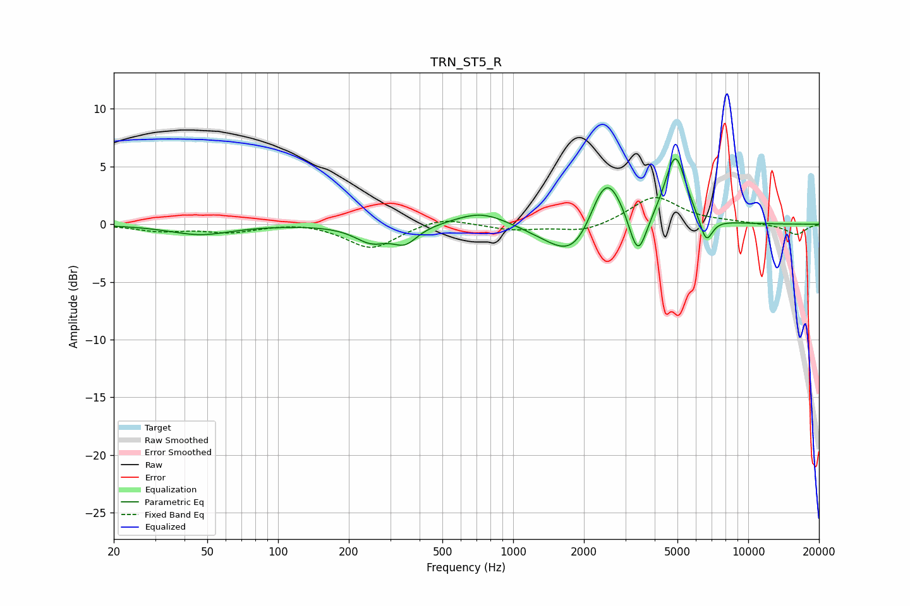

# TRN_ST5_R
See [usage instructions](https://github.com/jaakkopasanen/AutoEq#usage) for more options and info.

### Parametric EQs
Apply preamp of -5.8 dB when using parametric equalizer.

|   # | Type    |   Fc (Hz) |    Q |   Gain (dB) |
|-----|---------|-----------|------|-------------|
|   1 | Peaking |        47 | 1.08 |        -0.9 |
|   2 | Peaking |       249 | 2    |        -1.6 |
|   3 | Peaking |       251 | 2.02 |         0.2 |
|   4 | Peaking |       347 | 2.68 |        -1.4 |
|   5 | Peaking |       736 | 1.25 |         1.3 |
|   6 | Peaking |      1877 | 1.19 |        -4.5 |
|   7 | Peaking |      2473 | 1.8  |         6.5 |
|   8 | Peaking |      3391 | 3.66 |        -4.1 |
|   9 | Peaking |      4898 | 3.05 |         6   |
|  10 | Peaking |      6622 | 4.95 |        -2.3 |

### Fixed Band EQs
When using fixed band (also called graphic) equalizer, apply preamp of **-2.4 dB** (if available) and set gains manually with these parameters.

|   # | Type    |   Fc (Hz) |    Q |   Gain (dB) |
|-----|---------|-----------|------|-------------|
|   1 | Peaking |        31 | 1.41 |        -0.5 |
|   2 | Peaking |        62 | 1.41 |        -0.6 |
|   3 | Peaking |       125 | 1.41 |         0.2 |
|   4 | Peaking |       250 | 1.41 |        -2.1 |
|   5 | Peaking |       500 | 1.41 |         0.7 |
|   6 | Peaking |      1000 | 1.41 |        -0.5 |
|   7 | Peaking |      2000 | 1.41 |        -0.7 |
|   8 | Peaking |      4000 | 1.41 |         2.4 |
|   9 | Peaking |      8000 | 1.41 |         0.2 |
|  10 | Peaking |     16000 | 1.41 |        -0.9 |

### Graphs

