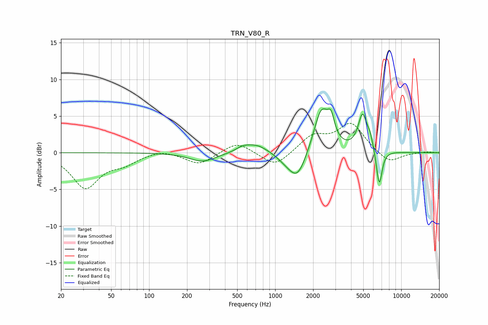

# TRN_V80_R
See [usage instructions](https://github.com/jaakkopasanen/AutoEq#usage) for more options and info.

### Parametric EQs
Apply preamp of -6.1 dB when using parametric equalizer.

|   # | Type    |   Fc (Hz) |    Q |   Gain (dB) |
|-----|---------|-----------|------|-------------|
|   1 | Peaking |       266 | 1.4  |        -1.2 |
|   2 | Peaking |       554 | 2.6  |         0.6 |
|   3 | Peaking |       716 | 1.63 |         1.1 |
|   4 | Peaking |      1208 | 2.2  |        -0.6 |
|   5 | Peaking |      1501 | 1.99 |        -3.8 |
|   6 | Peaking |      2330 | 2.29 |         6.1 |
|   7 | Peaking |      2779 | 5.4  |         2.5 |
|   8 | Peaking |      4939 | 3.87 |         4.9 |
|   9 | Peaking |      5676 | 5.99 |         1.3 |
|  10 | Peaking |      6691 | 6    |        -5   |

### Fixed Band EQs
When using fixed band (also called graphic) equalizer, apply preamp of **-4.1 dB** (if available) and set gains manually with these parameters.

|   # | Type    |   Fc (Hz) |    Q |   Gain (dB) |
|-----|---------|-----------|------|-------------|
|   1 | Peaking |        31 | 1.41 |        -4.7 |
|   2 | Peaking |        62 | 1.41 |        -1.2 |
|   3 | Peaking |       125 | 1.41 |         0.5 |
|   4 | Peaking |       250 | 1.41 |        -1.6 |
|   5 | Peaking |       500 | 1.41 |         1.6 |
|   6 | Peaking |      1000 | 1.41 |        -2   |
|   7 | Peaking |      2000 | 1.41 |         2.2 |
|   8 | Peaking |      4000 | 1.41 |         3.9 |
|   9 | Peaking |      8000 | 1.41 |        -1.5 |
|  10 | Peaking |     16000 | 1.41 |         0.1 |

### Graphs

