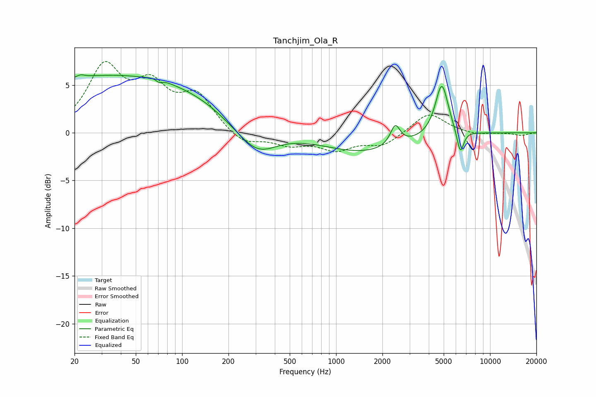

# Tanchjim_Ola_R
See [usage instructions](https://github.com/jaakkopasanen/AutoEq#usage) for more options and info.

### Parametric EQs
Apply preamp of -6.2 dB when using parametric equalizer.

|   # | Type    |   Fc (Hz) |    Q |   Gain (dB) |
|-----|---------|-----------|------|-------------|
|   1 | Peaking |        22 | 5.91 |         0.3 |
|   2 | Peaking |        36 | 0.19 |         6.1 |
|   3 | Peaking |        70 | 3.59 |         0.7 |
|   4 | Peaking |        71 | 5.29 |        -0.8 |
|   5 | Peaking |       228 | 0.95 |        -0.7 |
|   6 | Peaking |       310 | 1.13 |        -2.6 |
|   7 | Peaking |      1507 | 0.53 |        -2   |
|   8 | Peaking |      2423 | 4.5  |         2.1 |
|   9 | Peaking |      4860 | 3.3  |         5.5 |
|  10 | Peaking |      6407 | 6    |        -2.6 |

### Fixed Band EQs
When using fixed band (also called graphic) equalizer, apply preamp of **-7.6 dB** (if available) and set gains manually with these parameters.

|   # | Type    |   Fc (Hz) |    Q |   Gain (dB) |
|-----|---------|-----------|------|-------------|
|   1 | Peaking |        31 | 1.41 |         6.5 |
|   2 | Peaking |        62 | 1.41 |         4.2 |
|   3 | Peaking |       125 | 1.41 |         3.6 |
|   4 | Peaking |       250 | 1.41 |        -1.3 |
|   5 | Peaking |       500 | 1.41 |        -1.1 |
|   6 | Peaking |      1000 | 1.41 |        -1.6 |
|   7 | Peaking |      2000 | 1.41 |        -1.3 |
|   8 | Peaking |      4000 | 1.41 |         2.2 |
|   9 | Peaking |      8000 | 1.41 |        -0.3 |
|  10 | Peaking |     16000 | 1.41 |        -0.3 |

### Graphs

