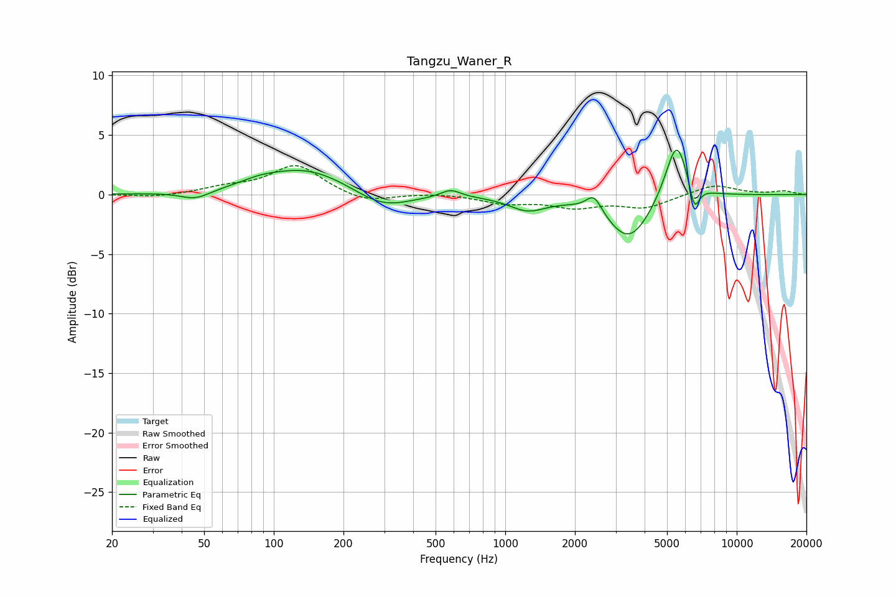

# Tangzu_Waner_R
See [usage instructions](https://github.com/jaakkopasanen/AutoEq#usage) for more options and info.

### Parametric EQs
Apply preamp of -3.8 dB when using parametric equalizer.

|   # | Type    |   Fc (Hz) |    Q |   Gain (dB) |
|-----|---------|-----------|------|-------------|
|   1 | Peaking |        46 | 2.21 |        -0.7 |
|   2 | Peaking |        87 | 1.9  |         0.3 |
|   3 | Peaking |       137 | 0.74 |         2.3 |
|   4 | Peaking |       294 | 1.14 |        -1.5 |
|   5 | Peaking |       581 | 3.32 |         0.6 |
|   6 | Peaking |      1249 | 1.76 |        -1.2 |
|   7 | Peaking |      2419 | 4.22 |         1.5 |
|   8 | Peaking |      3432 | 1.47 |        -3.9 |
|   9 | Peaking |      5500 | 2.8  |         5.3 |
|  10 | Peaking |      6556 | 6    |        -2.4 |

### Fixed Band EQs
When using fixed band (also called graphic) equalizer, apply preamp of **-2.5 dB** (if available) and set gains manually with these parameters.

|   # | Type    |   Fc (Hz) |    Q |   Gain (dB) |
|-----|---------|-----------|------|-------------|
|   1 | Peaking |        31 | 1.41 |        -0.2 |
|   2 | Peaking |        62 | 1.41 |         0.5 |
|   3 | Peaking |       125 | 1.41 |         2.5 |
|   4 | Peaking |       250 | 1.41 |        -0.7 |
|   5 | Peaking |       500 | 1.41 |         0.1 |
|   6 | Peaking |      1000 | 1.41 |        -0.7 |
|   7 | Peaking |      2000 | 1.41 |        -1   |
|   8 | Peaking |      4000 | 1.41 |        -1.1 |
|   9 | Peaking |      8000 | 1.41 |         0.9 |
|  10 | Peaking |     16000 | 1.41 |         0.3 |

### Graphs

