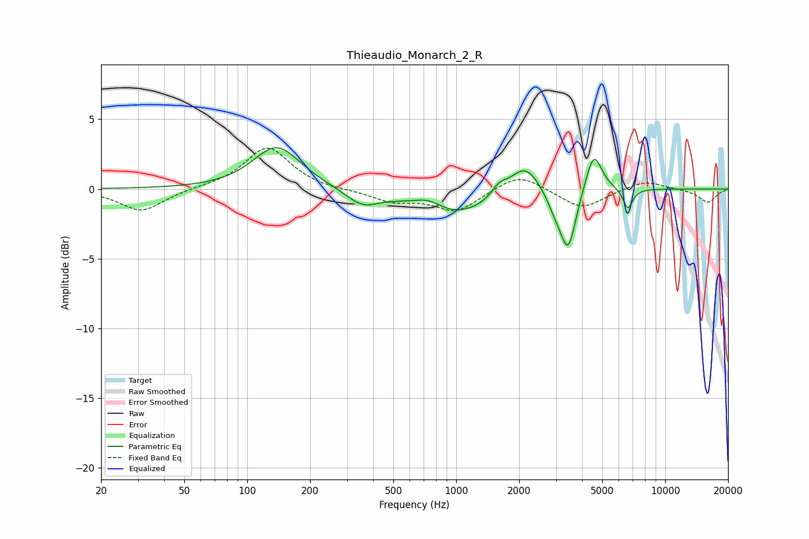

# Thieaudio_Monarch_2_R
See [usage instructions](https://github.com/jaakkopasanen/AutoEq#usage) for more options and info.

### Parametric EQs
Apply preamp of -3.0 dB when using parametric equalizer.

|   # | Type    |   Fc (Hz) |    Q |   Gain (dB) |
|-----|---------|-----------|------|-------------|
|   1 | Peaking |       139 | 1.25 |         3.1 |
|   2 | Peaking |       356 | 1.8  |        -1.1 |
|   3 | Peaking |       735 | 2.13 |         0.7 |
|   4 | Peaking |       991 | 0.76 |        -1.9 |
|   5 | Peaking |      1608 | 3.96 |         0.7 |
|   6 | Peaking |      2128 | 1.92 |         2.2 |
|   7 | Peaking |      2973 | 3.55 |        -1   |
|   8 | Peaking |      3436 | 3.74 |        -4.2 |
|   9 | Peaking |      4551 | 3.61 |         2.9 |
|  10 | Peaking |      6631 | 6    |        -1.5 |

### Fixed Band EQs
When using fixed band (also called graphic) equalizer, apply preamp of **-3.0 dB** (if available) and set gains manually with these parameters.

|   # | Type    |   Fc (Hz) |    Q |   Gain (dB) |
|-----|---------|-----------|------|-------------|
|   1 | Peaking |        31 | 1.41 |        -1.6 |
|   2 | Peaking |        62 | 1.41 |         0.1 |
|   3 | Peaking |       125 | 1.41 |         3   |
|   4 | Peaking |       250 | 1.41 |        -0.1 |
|   5 | Peaking |       500 | 1.41 |        -0.8 |
|   6 | Peaking |      1000 | 1.41 |        -1.6 |
|   7 | Peaking |      2000 | 1.41 |         1.2 |
|   8 | Peaking |      4000 | 1.41 |        -1.4 |
|   9 | Peaking |      8000 | 1.41 |         0.6 |
|  10 | Peaking |     16000 | 1.41 |        -1   |

### Graphs

