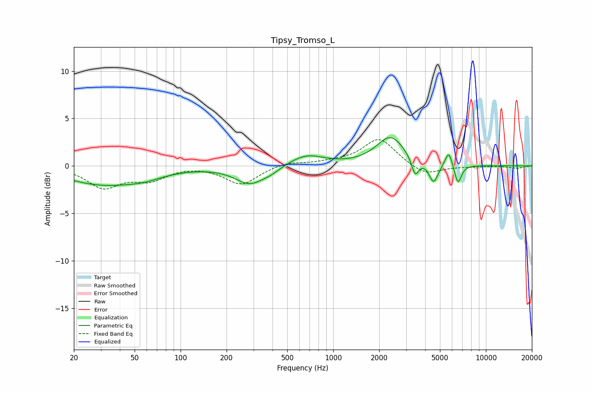

# Tipsy_Tromso_L
See [usage instructions](https://github.com/jaakkopasanen/AutoEq#usage) for more options and info.

### Parametric EQs
Apply preamp of -3.1 dB when using parametric equalizer.

|   # | Type    |   Fc (Hz) |    Q |   Gain (dB) |
|-----|---------|-----------|------|-------------|
|   1 | Peaking |        30 | 0.58 |        -1.9 |
|   2 | Peaking |        58 | 1.13 |        -0.6 |
|   3 | Peaking |       285 | 1.45 |        -1.9 |
|   4 | Peaking |       392 | 2.43 |        -0.4 |
|   5 | Peaking |       665 | 1.24 |         1.2 |
|   6 | Peaking |      2373 | 1.53 |         3   |
|   7 | Peaking |      3438 | 5.96 |        -1.9 |
|   8 | Peaking |      4542 | 4.75 |        -2.1 |
|   9 | Peaking |      5708 | 5.99 |         1.7 |
|  10 | Peaking |      6557 | 6    |        -2   |

### Fixed Band EQs
When using fixed band (also called graphic) equalizer, apply preamp of **-2.9 dB** (if available) and set gains manually with these parameters.

|   # | Type    |   Fc (Hz) |    Q |   Gain (dB) |
|-----|---------|-----------|------|-------------|
|   1 | Peaking |        31 | 1.41 |        -2.2 |
|   2 | Peaking |        62 | 1.41 |        -1.3 |
|   3 | Peaking |       125 | 1.41 |         0.1 |
|   4 | Peaking |       250 | 1.41 |        -2   |
|   5 | Peaking |       500 | 1.41 |         0.4 |
|   6 | Peaking |      1000 | 1.41 |         0.3 |
|   7 | Peaking |      2000 | 1.41 |         2.9 |
|   8 | Peaking |      4000 | 1.41 |        -1.1 |
|   9 | Peaking |      8000 | 1.41 |        -0.1 |
|  10 | Peaking |     16000 | 1.41 |        -0.3 |

### Graphs

