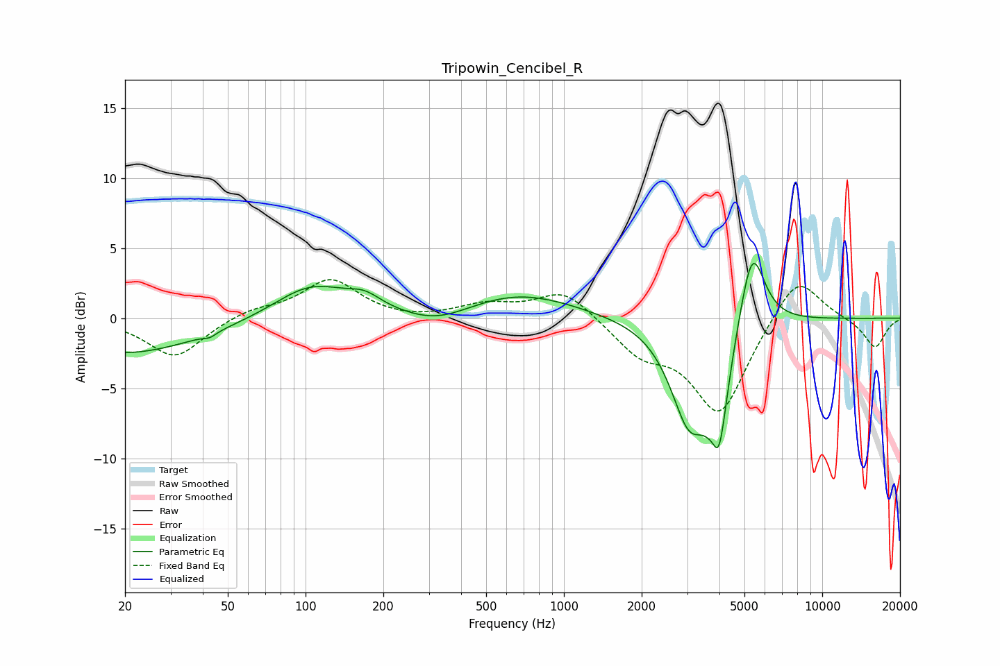

# Tripowin_Cencibel_R
See [usage instructions](https://github.com/jaakkopasanen/AutoEq#usage) for more options and info.

### Parametric EQs
Apply preamp of -4.0 dB when using parametric equalizer.

|   # | Type    |   Fc (Hz) |    Q |   Gain (dB) |
|-----|---------|-----------|------|-------------|
|   1 | Peaking |        20 | 0.47 |        -2.6 |
|   2 | Peaking |        43 | 5.75 |        -0.3 |
|   3 | Peaking |       105 | 0.98 |         2.4 |
|   4 | Peaking |       169 | 2.18 |         0.9 |
|   5 | Peaking |       323 | 1.12 |        -1   |
|   6 | Peaking |       670 | 0.65 |         1.8 |
|   7 | Peaking |      3058 | 1.89 |        -7   |
|   8 | Peaking |      3851 | 6    |         2.7 |
|   9 | Peaking |      3930 | 3.92 |        -9.7 |
|  10 | Peaking |      5348 | 2.84 |         6.1 |

### Fixed Band EQs
When using fixed band (also called graphic) equalizer, apply preamp of **-2.8 dB** (if available) and set gains manually with these parameters.

|   # | Type    |   Fc (Hz) |    Q |   Gain (dB) |
|-----|---------|-----------|------|-------------|
|   1 | Peaking |        31 | 1.41 |        -2.8 |
|   2 | Peaking |        62 | 1.41 |         0.6 |
|   3 | Peaking |       125 | 1.41 |         2.7 |
|   4 | Peaking |       250 | 1.41 |        -0.2 |
|   5 | Peaking |       500 | 1.41 |         0.9 |
|   6 | Peaking |      1000 | 1.41 |         2.1 |
|   7 | Peaking |      2000 | 1.41 |        -2.2 |
|   8 | Peaking |      4000 | 1.41 |        -6.8 |
|   9 | Peaking |      8000 | 1.41 |         3.4 |
|  10 | Peaking |     16000 | 1.41 |        -2.1 |

### Graphs

