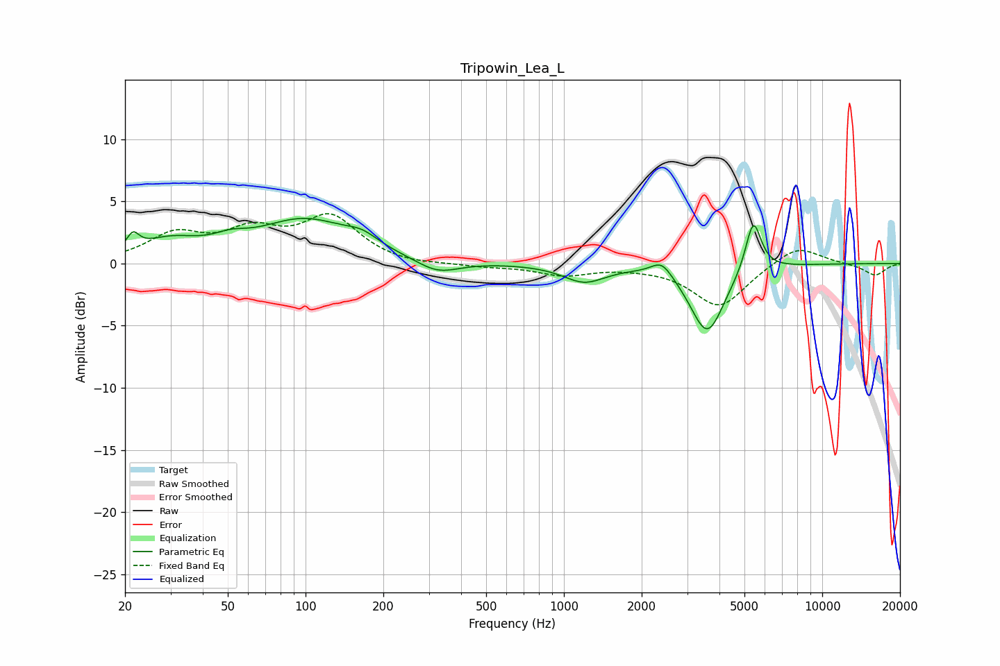

# Tripowin_Lea_L
See [usage instructions](https://github.com/jaakkopasanen/AutoEq#usage) for more options and info.

### Parametric EQs
Apply preamp of -3.7 dB when using parametric equalizer.

|   # | Type    |   Fc (Hz) |    Q |   Gain (dB) |
|-----|---------|-----------|------|-------------|
|   1 | Peaking |        21 | 6    |         1.3 |
|   2 | Peaking |        30 | 1.22 |         1.5 |
|   3 | Peaking |        51 | 2.17 |         0.7 |
|   4 | Peaking |        99 | 0.77 |         3.4 |
|   5 | Peaking |       166 | 2.24 |         0.8 |
|   6 | Peaking |       324 | 1.71 |        -1.1 |
|   7 | Peaking |      1198 | 1.72 |        -1.4 |
|   8 | Peaking |      2395 | 3.43 |         1.2 |
|   9 | Peaking |      3590 | 2.13 |        -5.6 |
|  10 | Peaking |      5410 | 4.56 |         4.2 |

### Fixed Band EQs
When using fixed band (also called graphic) equalizer, apply preamp of **-4.1 dB** (if available) and set gains manually with these parameters.

|   # | Type    |   Fc (Hz) |    Q |   Gain (dB) |
|-----|---------|-----------|------|-------------|
|   1 | Peaking |        31 | 1.41 |         2.2 |
|   2 | Peaking |        62 | 1.41 |         2.3 |
|   3 | Peaking |       125 | 1.41 |         3.5 |
|   4 | Peaking |       250 | 1.41 |        -0.2 |
|   5 | Peaking |       500 | 1.41 |        -0.2 |
|   6 | Peaking |      1000 | 1.41 |        -0.9 |
|   7 | Peaking |      2000 | 1.41 |        -0.1 |
|   8 | Peaking |      4000 | 1.41 |        -3.5 |
|   9 | Peaking |      8000 | 1.41 |         1.6 |
|  10 | Peaking |     16000 | 1.41 |        -1   |

### Graphs

