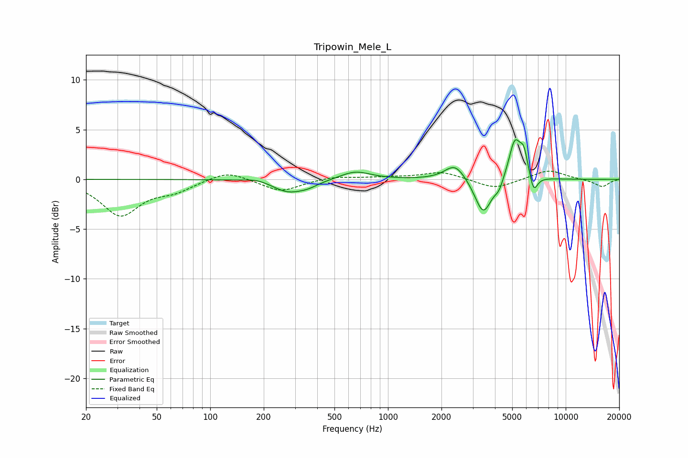

# Tripowin_Mele_L
See [usage instructions](https://github.com/jaakkopasanen/AutoEq#usage) for more options and info.

### Parametric EQs
Apply preamp of -4.1 dB when using parametric equalizer.

|   # | Type    |   Fc (Hz) |    Q |   Gain (dB) |
|-----|---------|-----------|------|-------------|
|   1 | Peaking |       185 | 1.94 |         0.3 |
|   2 | Peaking |       275 | 1.51 |        -1.3 |
|   3 | Peaking |       358 | 2.56 |        -0.4 |
|   4 | Peaking |       654 | 1.67 |         0.9 |
|   5 | Peaking |      2389 | 2.45 |         1.7 |
|   6 | Peaking |      3437 | 2.97 |        -3.6 |
|   7 | Peaking |      4214 | 6    |        -0.8 |
|   8 | Peaking |      5170 | 4.14 |         3.9 |
|   9 | Peaking |      5819 | 6    |         2.2 |
|  10 | Peaking |      6599 | 6    |        -1.8 |

### Fixed Band EQs
When using fixed band (also called graphic) equalizer, apply preamp of **-0.9 dB** (if available) and set gains manually with these parameters.

|   # | Type    |   Fc (Hz) |    Q |   Gain (dB) |
|-----|---------|-----------|------|-------------|
|   1 | Peaking |        31 | 1.41 |        -3.5 |
|   2 | Peaking |        62 | 1.41 |        -1   |
|   3 | Peaking |       125 | 1.41 |         1   |
|   4 | Peaking |       250 | 1.41 |        -1.2 |
|   5 | Peaking |       500 | 1.41 |         0.3 |
|   6 | Peaking |      1000 | 1.41 |         0.2 |
|   7 | Peaking |      2000 | 1.41 |         0.8 |
|   8 | Peaking |      4000 | 1.41 |        -1   |
|   9 | Peaking |      8000 | 1.41 |         1   |
|  10 | Peaking |     16000 | 1.41 |        -0.8 |

### Graphs

