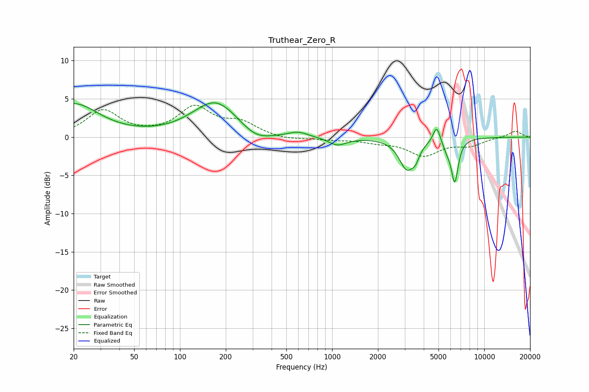

# Truthear_Zero_R
See [usage instructions](https://github.com/jaakkopasanen/AutoEq#usage) for more options and info.

### Parametric EQs
Apply preamp of -4.6 dB when using parametric equalizer.

|   # | Type    |   Fc (Hz) |    Q |   Gain (dB) |
|-----|---------|-----------|------|-------------|
|   1 | Peaking |        20 | 0.87 |         4.3 |
|   2 | Peaking |       172 | 0.93 |         4.7 |
|   3 | Peaking |       315 | 1.37 |        -1.5 |
|   4 | Peaking |       598 | 2.36 |         0.6 |
|   5 | Peaking |      1084 | 2.32 |        -1.1 |
|   6 | Peaking |      3101 | 2.77 |        -4   |
|   7 | Peaking |      3537 | 5.96 |        -1.2 |
|   8 | Peaking |      4866 | 6    |         2.2 |
|   9 | Peaking |      5667 | 5.17 |        -1   |
|  10 | Peaking |      6395 | 6    |        -5.5 |

### Fixed Band EQs
When using fixed band (also called graphic) equalizer, apply preamp of **-4.3 dB** (if available) and set gains manually with these parameters.

|   # | Type    |   Fc (Hz) |    Q |   Gain (dB) |
|-----|---------|-----------|------|-------------|
|   1 | Peaking |        31 | 1.41 |         3.4 |
|   2 | Peaking |        62 | 1.41 |         0.1 |
|   3 | Peaking |       125 | 1.41 |         3.7 |
|   4 | Peaking |       250 | 1.41 |         1.7 |
|   5 | Peaking |       500 | 1.41 |        -0.4 |
|   6 | Peaking |      1000 | 1.41 |        -0.3 |
|   7 | Peaking |      2000 | 1.41 |        -0.5 |
|   8 | Peaking |      4000 | 1.41 |        -2.3 |
|   9 | Peaking |      8000 | 1.41 |        -1   |
|  10 | Peaking |     16000 | 1.41 |         0.8 |

### Graphs

