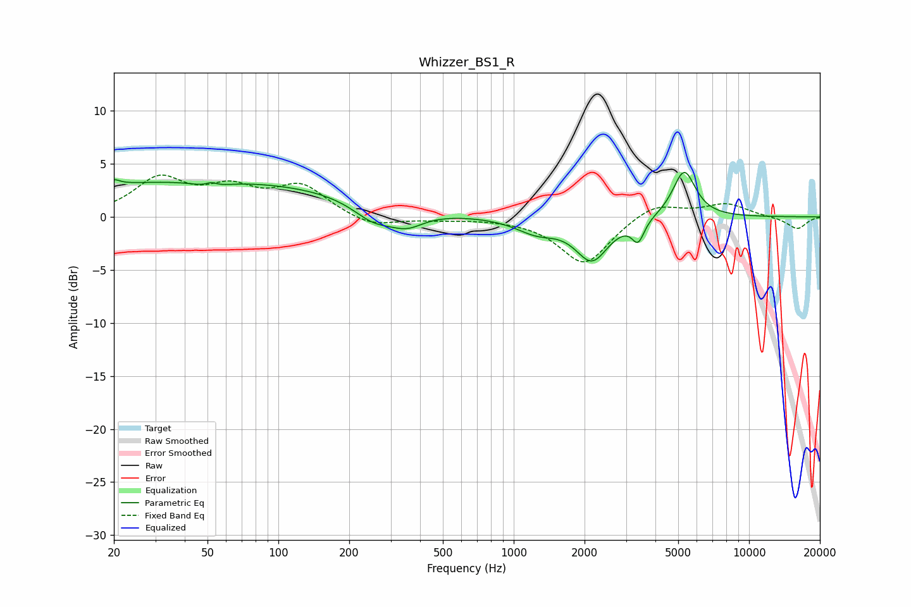

# Whizzer_BS1_R
See [usage instructions](https://github.com/jaakkopasanen/AutoEq#usage) for more options and info.

### Parametric EQs
Apply preamp of -4.3 dB when using parametric equalizer.

|   # | Type    |   Fc (Hz) |    Q |   Gain (dB) |
|-----|---------|-----------|------|-------------|
|   1 | Peaking |        20 | 5.82 |         0.5 |
|   2 | Peaking |        46 | 0.18 |         3.4 |
|   3 | Peaking |        51 | 2.19 |        -0.6 |
|   4 | Peaking |        52 | 5.86 |         0.4 |
|   5 | Peaking |       253 | 1.62 |        -1.7 |
|   6 | Peaking |       351 | 1.89 |        -1.4 |
|   7 | Peaking |      1252 | 1.59 |        -1.3 |
|   8 | Peaking |      2151 | 2.03 |        -3.9 |
|   9 | Peaking |      3379 | 5.54 |        -2   |
|  10 | Peaking |      5298 | 2.88 |         4.5 |

### Fixed Band EQs
When using fixed band (also called graphic) equalizer, apply preamp of **-4.0 dB** (if available) and set gains manually with these parameters.

|   # | Type    |   Fc (Hz) |    Q |   Gain (dB) |
|-----|---------|-----------|------|-------------|
|   1 | Peaking |        31 | 1.41 |         3.4 |
|   2 | Peaking |        62 | 1.41 |         2.3 |
|   3 | Peaking |       125 | 1.41 |         2.8 |
|   4 | Peaking |       250 | 1.41 |        -1   |
|   5 | Peaking |       500 | 1.41 |        -0.2 |
|   6 | Peaking |      1000 | 1.41 |        -0.1 |
|   7 | Peaking |      2000 | 1.41 |        -4.5 |
|   8 | Peaking |      4000 | 1.41 |         1.4 |
|   9 | Peaking |      8000 | 1.41 |         1.2 |
|  10 | Peaking |     16000 | 1.41 |        -1.2 |

### Graphs

