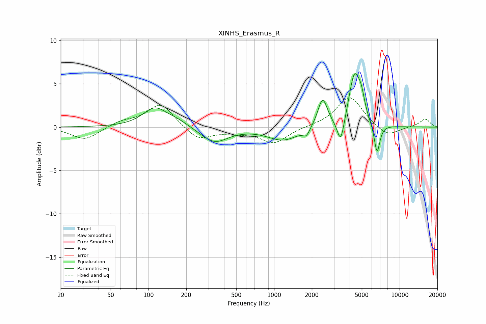

# XINHS_Erasmus_R
See [usage instructions](https://github.com/jaakkopasanen/AutoEq#usage) for more options and info.

### Parametric EQs
Apply preamp of -6.3 dB when using parametric equalizer.

|   # | Type    |   Fc (Hz) |    Q |   Gain (dB) |
|-----|---------|-----------|------|-------------|
|   1 | Peaking |       112 | 1.49 |         2.1 |
|   2 | Peaking |       170 | 1.52 |         0.6 |
|   3 | Peaking |       335 | 1.31 |        -1.8 |
|   4 | Peaking |      1185 | 1.14 |        -1.5 |
|   5 | Peaking |      1811 | 5.37 |        -0.8 |
|   6 | Peaking |      2437 | 3.66 |         3.4 |
|   7 | Peaking |      3401 | 4.98 |        -3   |
|   8 | Peaking |      4368 | 3.14 |         6   |
|   9 | Peaking |      4958 | 5.26 |         1.8 |
|  10 | Peaking |      6610 | 5.97 |        -3.5 |

### Fixed Band EQs
When using fixed band (also called graphic) equalizer, apply preamp of **-3.5 dB** (if available) and set gains manually with these parameters.

|   # | Type    |   Fc (Hz) |    Q |   Gain (dB) |
|-----|---------|-----------|------|-------------|
|   1 | Peaking |        31 | 1.41 |        -1.5 |
|   2 | Peaking |        62 | 1.41 |         0.6 |
|   3 | Peaking |       125 | 1.41 |         2.7 |
|   4 | Peaking |       250 | 1.41 |        -1.5 |
|   5 | Peaking |       500 | 1.41 |        -0.5 |
|   6 | Peaking |      1000 | 1.41 |        -1.8 |
|   7 | Peaking |      2000 | 1.41 |         0.1 |
|   8 | Peaking |      4000 | 1.41 |         3.6 |
|   9 | Peaking |      8000 | 1.41 |        -1.2 |
|  10 | Peaking |     16000 | 1.41 |         1   |

### Graphs

