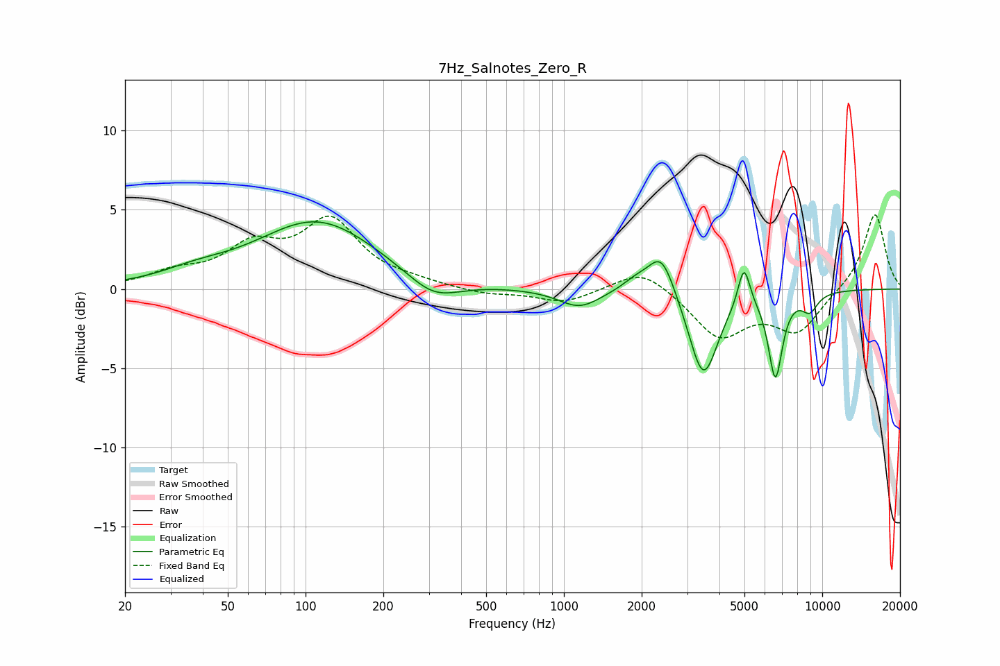

# 7Hz_Salnotes_Zero_R
See [usage instructions](https://github.com/jaakkopasanen/AutoEq#usage) for more options and info.

### Parametric EQs
Apply preamp of -4.3 dB when using parametric equalizer.

|   # | Type    |   Fc (Hz) |    Q |   Gain (dB) |
|-----|---------|-----------|------|-------------|
|   1 | Peaking |        37 | 1.06 |         0.6 |
|   2 | Peaking |       111 | 0.61 |         4.3 |
|   3 | Peaking |       312 | 1.39 |        -1.4 |
|   4 | Peaking |      1149 | 1.74 |        -1.2 |
|   5 | Peaking |      1908 | 2.47 |         0.7 |
|   6 | Peaking |      2390 | 2.74 |         2.7 |
|   7 | Peaking |      3466 | 2.5  |        -5.6 |
|   8 | Peaking |      4977 | 6    |         2.6 |
|   9 | Peaking |      6587 | 5.01 |        -5.3 |
|  10 | Peaking |      8947 | 4.14 |        -1.1 |

### Fixed Band EQs
When using fixed band (also called graphic) equalizer, apply preamp of **-4.8 dB** (if available) and set gains manually with these parameters.

|   # | Type    |   Fc (Hz) |    Q |   Gain (dB) |
|-----|---------|-----------|------|-------------|
|   1 | Peaking |        31 | 1.41 |         0.9 |
|   2 | Peaking |        62 | 1.41 |         2.4 |
|   3 | Peaking |       125 | 1.41 |         4.1 |
|   4 | Peaking |       250 | 1.41 |         0.3 |
|   5 | Peaking |       500 | 1.41 |        -0.3 |
|   6 | Peaking |      1000 | 1.41 |        -0.9 |
|   7 | Peaking |      2000 | 1.41 |         1.4 |
|   8 | Peaking |      4000 | 1.41 |        -3   |
|   9 | Peaking |      8000 | 1.41 |        -2.6 |
|  10 | Peaking |     16000 | 1.41 |         4.9 |

### Graphs

