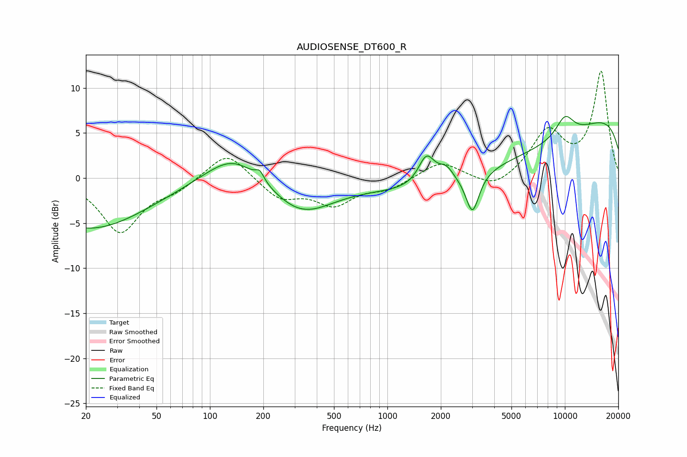

# AUDIOSENSE_DT600_R
See [usage instructions](https://github.com/jaakkopasanen/AutoEq#usage) for more options and info.

### Parametric EQs
Apply preamp of -6.9 dB when using parametric equalizer.

|   # | Type    |   Fc (Hz) |    Q |   Gain (dB) |
|-----|---------|-----------|------|-------------|
|   1 | Peaking |        21 | 0.43 |        -5.6 |
|   2 | Peaking |       136 | 0.9  |         3.4 |
|   3 | Peaking |       191 | 6    |         1   |
|   4 | Peaking |       325 | 0.79 |        -3.9 |
|   5 | Peaking |      1660 | 3.12 |         3.2 |
|   6 | Peaking |      2141 | 3.14 |         1.5 |
|   7 | Peaking |      3015 | 3.84 |        -4.4 |
|   8 | Peaking |      5049 | 0.23 |        -6.8 |
|   9 | Peaking |     10000 | 0.18 |        10.1 |
|  10 | Peaking |     10000 | 2.32 |         2.4 |

### Fixed Band EQs
When using fixed band (also called graphic) equalizer, apply preamp of **-11.9 dB** (if available) and set gains manually with these parameters.

|   # | Type    |   Fc (Hz) |    Q |   Gain (dB) |
|-----|---------|-----------|------|-------------|
|   1 | Peaking |        31 | 1.41 |        -5.9 |
|   2 | Peaking |        62 | 1.41 |        -1.1 |
|   3 | Peaking |       125 | 1.41 |         3.1 |
|   4 | Peaking |       250 | 1.41 |        -2.2 |
|   5 | Peaking |       500 | 1.41 |        -2.8 |
|   6 | Peaking |      1000 | 1.41 |        -1.1 |
|   7 | Peaking |      2000 | 1.41 |         1.9 |
|   8 | Peaking |      4000 | 1.41 |        -1.4 |
|   9 | Peaking |      8000 | 1.41 |         5   |
|  10 | Peaking |     16000 | 1.41 |        11.7 |

### Graphs

