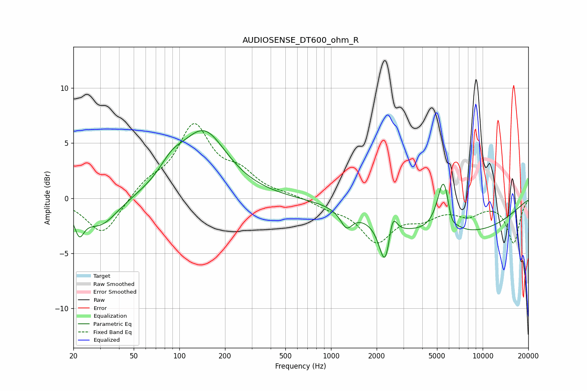

# AUDIOSENSE_DT600_ohm_R
See [usage instructions](https://github.com/jaakkopasanen/AutoEq#usage) for more options and info.

### Parametric EQs
Apply preamp of -6.2 dB when using parametric equalizer.

|   # | Type    |   Fc (Hz) |    Q |   Gain (dB) |
|-----|---------|-----------|------|-------------|
|   1 | Peaking |        22 | 4.47 |        -2.1 |
|   2 | Peaking |        30 | 1.23 |        -2.6 |
|   3 | Peaking |        89 | 1.77 |         1.5 |
|   4 | Peaking |       145 | 0.92 |         5.9 |
|   5 | Peaking |      1265 | 3.62 |        -1.5 |
|   6 | Peaking |      2282 | 3.73 |        -4.2 |
|   7 | Peaking |      2540 | 5.14 |         2.6 |
|   8 | Peaking |      5536 | 3.31 |         5.1 |
|   9 | Peaking |      6054 | 0.29 |        -3.4 |
|  10 | Peaking |      6199 | 4.84 |        -1.2 |

### Fixed Band EQs
When using fixed band (also called graphic) equalizer, apply preamp of **-6.9 dB** (if available) and set gains manually with these parameters.

|   # | Type    |   Fc (Hz) |    Q |   Gain (dB) |
|-----|---------|-----------|------|-------------|
|   1 | Peaking |        31 | 1.41 |        -3.4 |
|   2 | Peaking |        62 | 1.41 |         1.3 |
|   3 | Peaking |       125 | 1.41 |         6.3 |
|   4 | Peaking |       250 | 1.41 |         1.9 |
|   5 | Peaking |       500 | 1.41 |         0.2 |
|   6 | Peaking |      1000 | 1.41 |        -0.7 |
|   7 | Peaking |      2000 | 1.41 |        -3.7 |
|   8 | Peaking |      4000 | 1.41 |        -1.4 |
|   9 | Peaking |      8000 | 1.41 |        -1.3 |
|  10 | Peaking |     16000 | 1.41 |        -4   |

### Graphs

