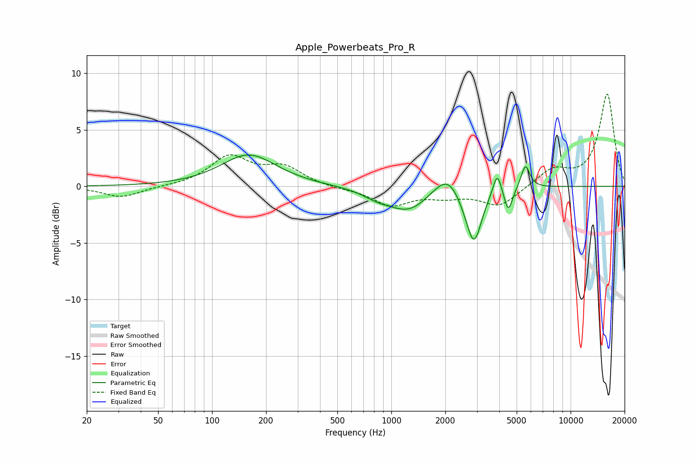

# Apple_Powerbeats_Pro_R
See [usage instructions](https://github.com/jaakkopasanen/AutoEq#usage) for more options and info.

### Parametric EQs
Apply preamp of -2.9 dB when using parametric equalizer.

|   # | Type    |   Fc (Hz) |    Q |   Gain (dB) |
|-----|---------|-----------|------|-------------|
|   1 | Peaking |       160 | 0.93 |         2.8 |
|   2 | Peaking |       832 | 1.78 |        -0.6 |
|   3 | Peaking |      1253 | 1.21 |        -2.1 |
|   4 | Peaking |      1807 | 1.89 |         0.5 |
|   5 | Peaking |      2087 | 2.22 |         1.5 |
|   6 | Peaking |      2679 | 2.58 |        -1   |
|   7 | Peaking |      2902 | 3.44 |        -4.2 |
|   8 | Peaking |      3895 | 6    |         2   |
|   9 | Peaking |      4491 | 6    |        -2.1 |
|  10 | Peaking |      5596 | 5.73 |         2.1 |

### Fixed Band EQs
When using fixed band (also called graphic) equalizer, apply preamp of **-8.2 dB** (if available) and set gains manually with these parameters.

|   # | Type    |   Fc (Hz) |    Q |   Gain (dB) |
|-----|---------|-----------|------|-------------|
|   1 | Peaking |        31 | 1.41 |        -1   |
|   2 | Peaking |        62 | 1.41 |        -0   |
|   3 | Peaking |       125 | 1.41 |         2.5 |
|   4 | Peaking |       250 | 1.41 |         1.6 |
|   5 | Peaking |       500 | 1.41 |        -0.2 |
|   6 | Peaking |      1000 | 1.41 |        -1.6 |
|   7 | Peaking |      2000 | 1.41 |        -0.7 |
|   8 | Peaking |      4000 | 1.41 |        -1.7 |
|   9 | Peaking |      8000 | 1.41 |         1.5 |
|  10 | Peaking |     16000 | 1.41 |         8.1 |

### Graphs

