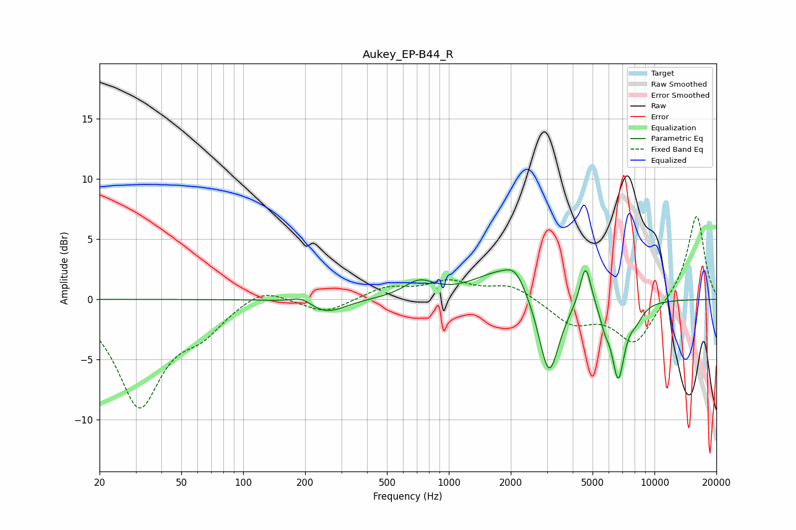

# Aukey_EP-B44_R
See [usage instructions](https://github.com/jaakkopasanen/AutoEq#usage) for more options and info.

### Parametric EQs
Apply preamp of -2.6 dB when using parametric equalizer.

|   # | Type    |   Fc (Hz) |    Q |   Gain (dB) |
|-----|---------|-----------|------|-------------|
|   1 | Peaking |       193 | 2.77 |         0.6 |
|   2 | Peaking |       253 | 1.56 |        -1.2 |
|   3 | Peaking |       716 | 1.94 |         1.3 |
|   4 | Peaking |      1829 | 1.02 |         2.4 |
|   5 | Peaking |      2113 | 3.05 |         1.2 |
|   6 | Peaking |      3067 | 2.81 |        -7   |
|   7 | Peaking |      4622 | 5.22 |         3.6 |
|   8 | Peaking |      5735 | 6    |        -1.2 |
|   9 | Peaking |      6662 | 4.27 |        -6.2 |
|  10 | Peaking |      8123 | 3.71 |        -1   |

### Fixed Band EQs
When using fixed band (also called graphic) equalizer, apply preamp of **-7.0 dB** (if available) and set gains manually with these parameters.

|   # | Type    |   Fc (Hz) |    Q |   Gain (dB) |
|-----|---------|-----------|------|-------------|
|   1 | Peaking |        31 | 1.41 |        -8.7 |
|   2 | Peaking |        62 | 1.41 |        -2.1 |
|   3 | Peaking |       125 | 1.41 |         1.2 |
|   4 | Peaking |       250 | 1.41 |        -1.1 |
|   5 | Peaking |       500 | 1.41 |         1   |
|   6 | Peaking |      1000 | 1.41 |         1.4 |
|   7 | Peaking |      2000 | 1.41 |         1.2 |
|   8 | Peaking |      4000 | 1.41 |        -1.9 |
|   9 | Peaking |      8000 | 1.41 |        -3.7 |
|  10 | Peaking |     16000 | 1.41 |         7.1 |

### Graphs

