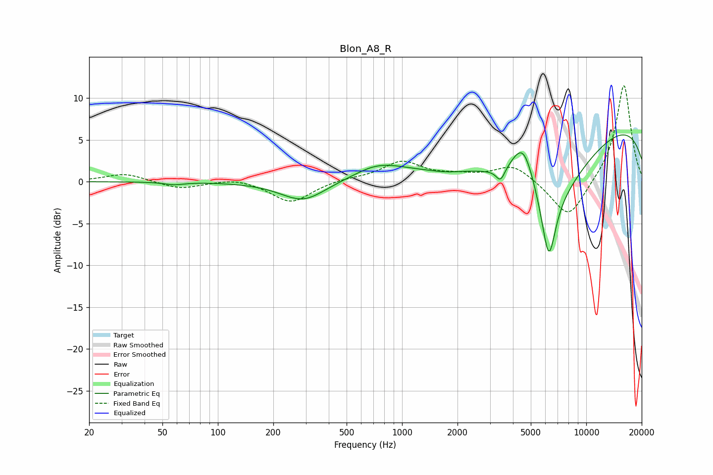

# Blon_A8_R
See [usage instructions](https://github.com/jaakkopasanen/AutoEq#usage) for more options and info.

### Parametric EQs
Apply preamp of -5.7 dB when using parametric equalizer.

|   # | Type    |   Fc (Hz) |    Q |   Gain (dB) |
|-----|---------|-----------|------|-------------|
|   1 | Peaking |        58 | 2.73 |        -0.3 |
|   2 | Peaking |       291 | 1.16 |        -2.4 |
|   3 | Peaking |       682 | 2.01 |         0.1 |
|   4 | Peaking |       756 | 0.99 |         1.7 |
|   5 | Peaking |      1754 | 1.54 |        -0.4 |
|   6 | Peaking |      3425 | 5.88 |        -1.6 |
|   7 | Peaking |      4566 | 1.95 |         6.8 |
|   8 | Peaking |      5931 | 0.62 |       -10.9 |
|   9 | Peaking |      6263 | 3.77 |        -7.5 |
|  10 | Peaking |      9965 | 0.18 |         8.1 |

### Fixed Band EQs
When using fixed band (also called graphic) equalizer, apply preamp of **-11.6 dB** (if available) and set gains manually with these parameters.

|   # | Type    |   Fc (Hz) |    Q |   Gain (dB) |
|-----|---------|-----------|------|-------------|
|   1 | Peaking |        31 | 1.41 |         1   |
|   2 | Peaking |        62 | 1.41 |        -0.9 |
|   3 | Peaking |       125 | 1.41 |         0.5 |
|   4 | Peaking |       250 | 1.41 |        -2.5 |
|   5 | Peaking |       500 | 1.41 |         0.3 |
|   6 | Peaking |      1000 | 1.41 |         2.3 |
|   7 | Peaking |      2000 | 1.41 |         0.5 |
|   8 | Peaking |      4000 | 1.41 |         2   |
|   9 | Peaking |      8000 | 1.41 |        -4.7 |
|  10 | Peaking |     16000 | 1.41 |        11.8 |

### Graphs

