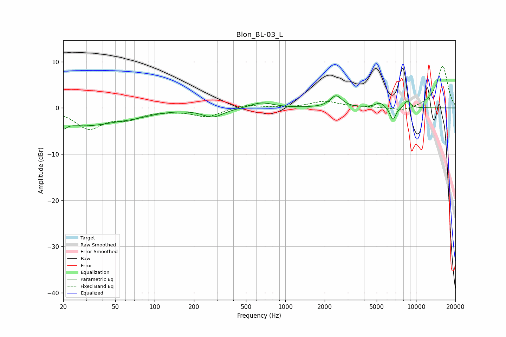

# Blon_BL-03_L
See [usage instructions](https://github.com/jaakkopasanen/AutoEq#usage) for more options and info.

### Parametric EQs
Apply preamp of -2.7 dB when using parametric equalizer.

|   # | Type    |   Fc (Hz) |    Q |   Gain (dB) |
|-----|---------|-----------|------|-------------|
|   1 | Peaking |        20 | 5.99 |        -4   |
|   2 | Peaking |        20 | 6    |         2.7 |
|   3 | Peaking |        28 | 0.57 |        -3.6 |
|   4 | Peaking |        70 | 0.97 |        -0.9 |
|   5 | Peaking |       279 | 1.77 |        -1.9 |
|   6 | Peaking |       657 | 1.65 |         1.2 |
|   7 | Peaking |      2447 | 3.19 |         2.6 |
|   8 | Peaking |      5306 | 3.69 |         1.2 |
|   9 | Peaking |      6650 | 6    |        -2.9 |
|  10 | Peaking |      8572 | 5.54 |         1.6 |

### Fixed Band EQs
When using fixed band (also called graphic) equalizer, apply preamp of **-9.1 dB** (if available) and set gains manually with these parameters.

|   # | Type    |   Fc (Hz) |    Q |   Gain (dB) |
|-----|---------|-----------|------|-------------|
|   1 | Peaking |        31 | 1.41 |        -4.3 |
|   2 | Peaking |        62 | 1.41 |        -2   |
|   3 | Peaking |       125 | 1.41 |        -0.3 |
|   4 | Peaking |       250 | 1.41 |        -1.9 |
|   5 | Peaking |       500 | 1.41 |         0.8 |
|   6 | Peaking |      1000 | 1.41 |        -0   |
|   7 | Peaking |      2000 | 1.41 |         1.4 |
|   8 | Peaking |      4000 | 1.41 |         0.1 |
|   9 | Peaking |      8000 | 1.41 |        -0.8 |
|  10 | Peaking |     16000 | 1.41 |         9.1 |

### Graphs

