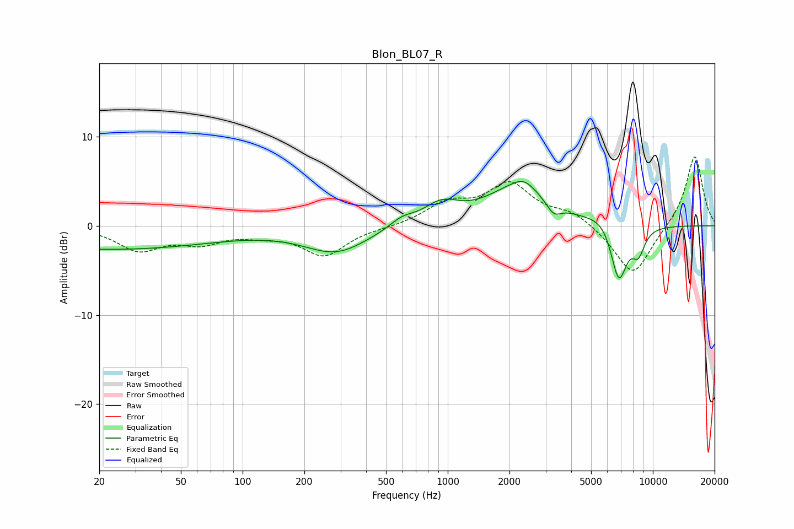

# Blon_BL07_R
See [usage instructions](https://github.com/jaakkopasanen/AutoEq#usage) for more options and info.

### Parametric EQs
Apply preamp of -5.1 dB when using parametric equalizer.

|   # | Type    |   Fc (Hz) |    Q |   Gain (dB) |
|-----|---------|-----------|------|-------------|
|   1 | Peaking |        22 | 0.25 |        -2.6 |
|   2 | Peaking |       286 | 0.9  |        -2.9 |
|   3 | Peaking |       598 | 2.35 |         1   |
|   4 | Peaking |       928 | 1.63 |         2.1 |
|   5 | Peaking |      2228 | 0.92 |         4.3 |
|   6 | Peaking |      2355 | 3.02 |         0.8 |
|   7 | Peaking |      3280 | 3.85 |        -1.4 |
|   8 | Peaking |      5837 | 1.92 |         1.2 |
|   9 | Peaking |      6816 | 3.28 |        -6.7 |
|  10 | Peaking |      8501 | 4.21 |        -2.6 |

### Fixed Band EQs
When using fixed band (also called graphic) equalizer, apply preamp of **-7.8 dB** (if available) and set gains manually with these parameters.

|   # | Type    |   Fc (Hz) |    Q |   Gain (dB) |
|-----|---------|-----------|------|-------------|
|   1 | Peaking |        31 | 1.41 |        -2.6 |
|   2 | Peaking |        62 | 1.41 |        -1.6 |
|   3 | Peaking |       125 | 1.41 |        -0.7 |
|   4 | Peaking |       250 | 1.41 |        -3.3 |
|   5 | Peaking |       500 | 1.41 |        -0.1 |
|   6 | Peaking |      1000 | 1.41 |         2.3 |
|   7 | Peaking |      2000 | 1.41 |         4.5 |
|   8 | Peaking |      4000 | 1.41 |         1.4 |
|   9 | Peaking |      8000 | 1.41 |        -5.8 |
|  10 | Peaking |     16000 | 1.41 |         8   |

### Graphs

