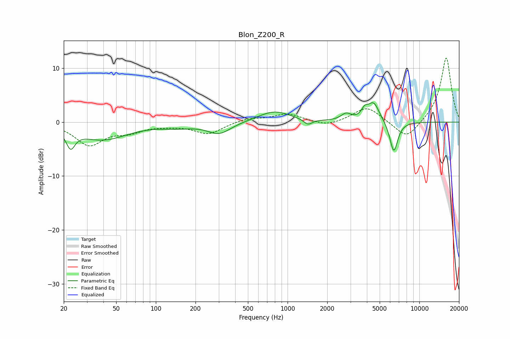

# Blon_Z200_R
See [usage instructions](https://github.com/jaakkopasanen/AutoEq#usage) for more options and info.

### Parametric EQs
Apply preamp of -3.7 dB when using parametric equalizer.

|   # | Type    |   Fc (Hz) |    Q |   Gain (dB) |
|-----|---------|-----------|------|-------------|
|   1 | Peaking |        23 | 4.27 |        -3.3 |
|   2 | Peaking |        40 | 0.75 |        -3.2 |
|   3 | Peaking |       146 | 1.16 |        -0.7 |
|   4 | Peaking |       303 | 1.61 |        -2.1 |
|   5 | Peaking |       792 | 1.15 |         2.1 |
|   6 | Peaking |      1427 | 4.42 |        -1.1 |
|   7 | Peaking |      2779 | 3.73 |         1.3 |
|   8 | Peaking |      3838 | 6    |         1.3 |
|   9 | Peaking |      4488 | 3.05 |         3.6 |
|  10 | Peaking |      6398 | 4.44 |        -5.8 |

### Fixed Band EQs
When using fixed band (also called graphic) equalizer, apply preamp of **-12.0 dB** (if available) and set gains manually with these parameters.

|   # | Type    |   Fc (Hz) |    Q |   Gain (dB) |
|-----|---------|-----------|------|-------------|
|   1 | Peaking |        31 | 1.41 |        -4.1 |
|   2 | Peaking |        62 | 1.41 |        -1.5 |
|   3 | Peaking |       125 | 1.41 |        -0.4 |
|   4 | Peaking |       250 | 1.41 |        -2.2 |
|   5 | Peaking |       500 | 1.41 |         0.7 |
|   6 | Peaking |      1000 | 1.41 |         1.5 |
|   7 | Peaking |      2000 | 1.41 |        -0.9 |
|   8 | Peaking |      4000 | 1.41 |         2.9 |
|   9 | Peaking |      8000 | 1.41 |        -3.4 |
|  10 | Peaking |     16000 | 1.41 |        12.1 |

### Graphs

