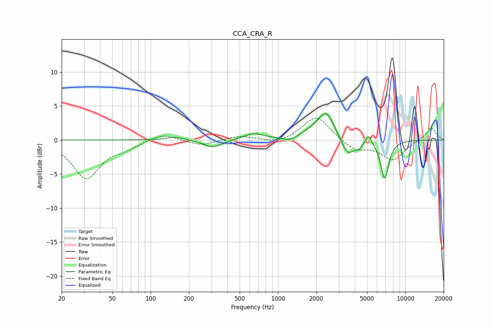

# CCA_CRA_R
See [usage instructions](https://github.com/jaakkopasanen/AutoEq#usage) for more options and info.

### Parametric EQs
Apply preamp of -4.0 dB when using parametric equalizer.

|   # | Type    |   Fc (Hz) |    Q |   Gain (dB) |
|-----|---------|-----------|------|-------------|
|   1 | Peaking |       157 | 2.14 |         0.5 |
|   2 | Peaking |       308 | 1.96 |        -1.1 |
|   3 | Peaking |       643 | 1.85 |         0.9 |
|   4 | Peaking |      1255 | 2.45 |        -0.7 |
|   5 | Peaking |      1766 | 1.28 |         0.7 |
|   6 | Peaking |      2385 | 2.15 |         3.9 |
|   7 | Peaking |      3532 | 2.74 |        -2.7 |
|   8 | Peaking |      4326 | 6    |        -0.8 |
|   9 | Peaking |      5157 | 6    |         1.4 |
|  10 | Peaking |      6883 | 4.2  |        -5.7 |

### Fixed Band EQs
When using fixed band (also called graphic) equalizer, apply preamp of **-3.3 dB** (if available) and set gains manually with these parameters.

|   # | Type    |   Fc (Hz) |    Q |   Gain (dB) |
|-----|---------|-----------|------|-------------|
|   1 | Peaking |        31 | 1.41 |        -5.6 |
|   2 | Peaking |        62 | 1.41 |        -0.9 |
|   3 | Peaking |       125 | 1.41 |         1   |
|   4 | Peaking |       250 | 1.41 |        -0.8 |
|   5 | Peaking |       500 | 1.41 |         0.6 |
|   6 | Peaking |      1000 | 1.41 |        -0.6 |
|   7 | Peaking |      2000 | 1.41 |         3.6 |
|   8 | Peaking |      4000 | 1.41 |        -1.5 |
|   9 | Peaking |      8000 | 1.41 |        -2.9 |
|  10 | Peaking |     16000 | 1.41 |         1.9 |

### Graphs

