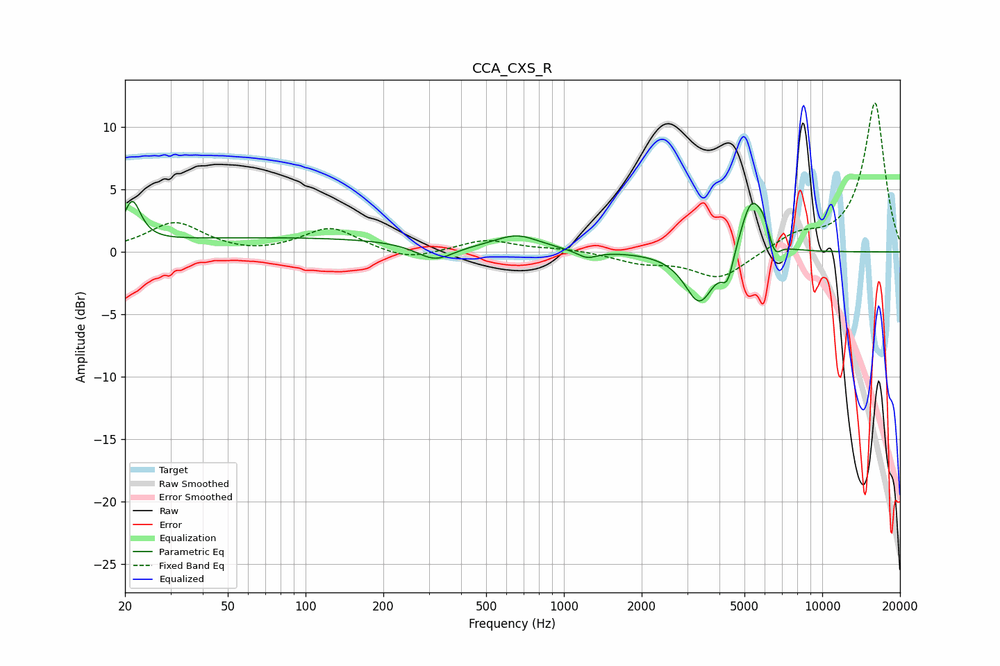

# CCA_CXS_R
See [usage instructions](https://github.com/jaakkopasanen/AutoEq#usage) for more options and info.

### Parametric EQs
Apply preamp of -4.1 dB when using parametric equalizer.

|   # | Type    |   Fc (Hz) |    Q |   Gain (dB) |
|-----|---------|-----------|------|-------------|
|   1 | Peaking |        21 | 4.44 |         3.3 |
|   2 | Peaking |        79 | 0.2  |         1.1 |
|   3 | Peaking |       317 | 1.94 |        -1.4 |
|   4 | Peaking |       660 | 1.64 |         1.2 |
|   5 | Peaking |      1229 | 3.61 |        -0.6 |
|   6 | Peaking |      3349 | 2.48 |        -4.1 |
|   7 | Peaking |      4300 | 5.95 |        -2.2 |
|   8 | Peaking |      5314 | 3.15 |         4.4 |
|   9 | Peaking |      5923 | 5.94 |         1.1 |
|  10 | Peaking |      6547 | 6    |        -1.3 |

### Fixed Band EQs
When using fixed band (also called graphic) equalizer, apply preamp of **-12.0 dB** (if available) and set gains manually with these parameters.

|   # | Type    |   Fc (Hz) |    Q |   Gain (dB) |
|-----|---------|-----------|------|-------------|
|   1 | Peaking |        31 | 1.41 |         2.3 |
|   2 | Peaking |        62 | 1.41 |        -0.3 |
|   3 | Peaking |       125 | 1.41 |         1.9 |
|   4 | Peaking |       250 | 1.41 |        -0.8 |
|   5 | Peaking |       500 | 1.41 |         1   |
|   6 | Peaking |      1000 | 1.41 |         0.2 |
|   7 | Peaking |      2000 | 1.41 |        -0.8 |
|   8 | Peaking |      4000 | 1.41 |        -2.2 |
|   9 | Peaking |      8000 | 1.41 |         1.2 |
|  10 | Peaking |     16000 | 1.41 |        12   |

### Graphs

