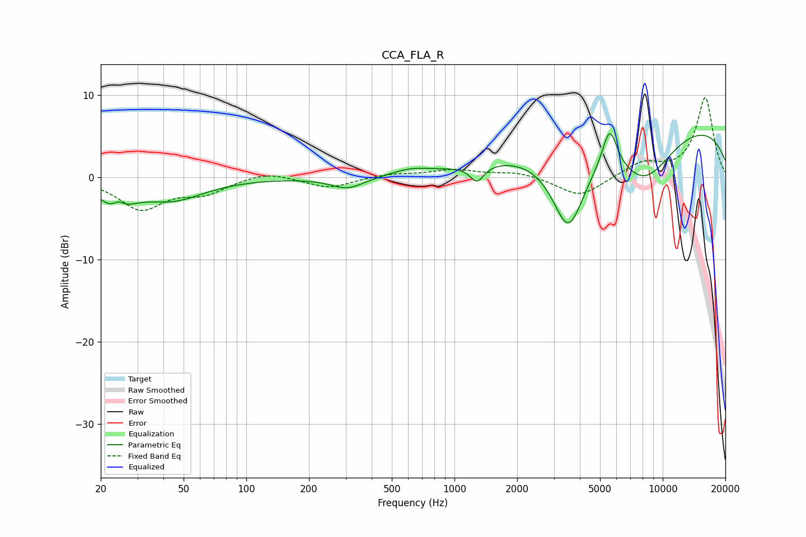

# CCA_FLA_R
See [usage instructions](https://github.com/jaakkopasanen/AutoEq#usage) for more options and info.

### Parametric EQs
Apply preamp of -5.4 dB when using parametric equalizer.

|   # | Type    |   Fc (Hz) |    Q |   Gain (dB) |
|-----|---------|-----------|------|-------------|
|   1 | Peaking |        24 | 2    |        -3.4 |
|   2 | Peaking |        24 | 4.49 |         1.5 |
|   3 | Peaking |        44 | 0.92 |        -2.5 |
|   4 | Peaking |       306 | 1.75 |        -1.4 |
|   5 | Peaking |       616 | 1.56 |         0.7 |
|   6 | Peaking |      1282 | 4.27 |        -2   |
|   7 | Peaking |      3523 | 1.68 |       -10.3 |
|   8 | Peaking |      5560 | 3.82 |         5.1 |
|   9 | Peaking |      8175 | 0.89 |        -6.7 |
|  10 | Peaking |      9067 | 0.18 |         7.4 |

### Fixed Band EQs
When using fixed band (also called graphic) equalizer, apply preamp of **-9.8 dB** (if available) and set gains manually with these parameters.

|   # | Type    |   Fc (Hz) |    Q |   Gain (dB) |
|-----|---------|-----------|------|-------------|
|   1 | Peaking |        31 | 1.41 |        -3.7 |
|   2 | Peaking |        62 | 1.41 |        -1.7 |
|   3 | Peaking |       125 | 1.41 |         0.8 |
|   4 | Peaking |       250 | 1.41 |        -1.3 |
|   5 | Peaking |       500 | 1.41 |         0.5 |
|   6 | Peaking |      1000 | 1.41 |         0.9 |
|   7 | Peaking |      2000 | 1.41 |         0.7 |
|   8 | Peaking |      4000 | 1.41 |        -2.4 |
|   9 | Peaking |      8000 | 1.41 |         1.7 |
|  10 | Peaking |     16000 | 1.41 |         9.7 |

### Graphs

