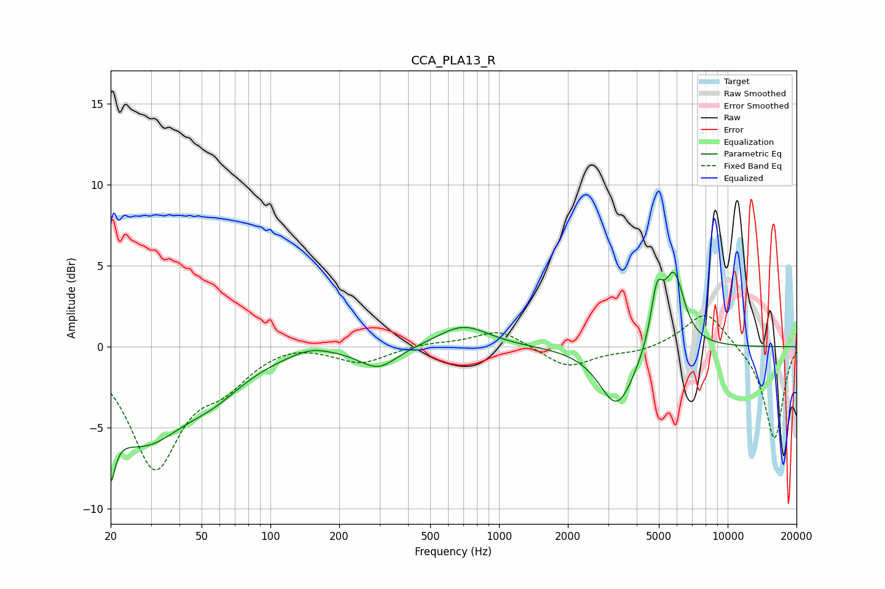

# CCA_PLA13_R
See [usage instructions](https://github.com/jaakkopasanen/AutoEq#usage) for more options and info.

### Parametric EQs
Apply preamp of -4.7 dB when using parametric equalizer.

|   # | Type    |   Fc (Hz) |    Q |   Gain (dB) |
|-----|---------|-----------|------|-------------|
|   1 | Peaking |        20 | 5.91 |        -6.9 |
|   2 | Peaking |        20 | 5.84 |         3.3 |
|   3 | Peaking |        27 | 0.73 |        -5.5 |
|   4 | Peaking |        57 | 1.06 |        -1.4 |
|   5 | Peaking |       150 | 1.67 |         0.5 |
|   6 | Peaking |       296 | 1.72 |        -1.3 |
|   7 | Peaking |       696 | 1.26 |         1.4 |
|   8 | Peaking |      3284 | 1.83 |        -3.8 |
|   9 | Peaking |      4901 | 5.2  |         3.1 |
|  10 | Peaking |      5826 | 3.03 |         4.5 |

### Fixed Band EQs
When using fixed band (also called graphic) equalizer, apply preamp of **-2.0 dB** (if available) and set gains manually with these parameters.

|   # | Type    |   Fc (Hz) |    Q |   Gain (dB) |
|-----|---------|-----------|------|-------------|
|   1 | Peaking |        31 | 1.41 |        -7.3 |
|   2 | Peaking |        62 | 1.41 |        -1.8 |
|   3 | Peaking |       125 | 1.41 |         0.4 |
|   4 | Peaking |       250 | 1.41 |        -1   |
|   5 | Peaking |       500 | 1.41 |         0.2 |
|   6 | Peaking |      1000 | 1.41 |         1.1 |
|   7 | Peaking |      2000 | 1.41 |        -1.3 |
|   8 | Peaking |      4000 | 1.41 |        -0.3 |
|   9 | Peaking |      8000 | 1.41 |         2.3 |
|  10 | Peaking |     16000 | 1.41 |        -5.8 |

### Graphs

