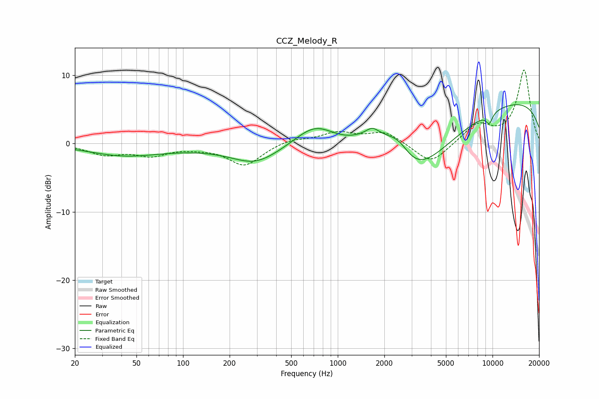

# CCZ_Melody_R
See [usage instructions](https://github.com/jaakkopasanen/AutoEq#usage) for more options and info.

### Parametric EQs
Apply preamp of -5.8 dB when using parametric equalizer.

|   # | Type    |   Fc (Hz) |    Q |   Gain (dB) |
|-----|---------|-----------|------|-------------|
|   1 | Peaking |        41 | 0.62 |        -1.5 |
|   2 | Peaking |       196 | 0.23 |        -0.5 |
|   3 | Peaking |       293 | 0.95 |        -2.4 |
|   4 | Peaking |       716 | 1.04 |         3.8 |
|   5 | Peaking |      1669 | 3.92 |         0.8 |
|   6 | Peaking |      1801 | 0.92 |         6.1 |
|   7 | Peaking |      2488 | 1.72 |         3.8 |
|   8 | Peaking |      2758 | 0.54 |       -12.4 |
|   9 | Peaking |      9528 | 5.97 |        -1.5 |
|  10 | Peaking |     10000 | 0.18 |         6.9 |

### Fixed Band EQs
When using fixed band (also called graphic) equalizer, apply preamp of **-10.9 dB** (if available) and set gains manually with these parameters.

|   # | Type    |   Fc (Hz) |    Q |   Gain (dB) |
|-----|---------|-----------|------|-------------|
|   1 | Peaking |        31 | 1.41 |        -1.5 |
|   2 | Peaking |        62 | 1.41 |        -1.6 |
|   3 | Peaking |       125 | 1.41 |        -0.4 |
|   4 | Peaking |       250 | 1.41 |        -3.2 |
|   5 | Peaking |       500 | 1.41 |         0.7 |
|   6 | Peaking |      1000 | 1.41 |         1.5 |
|   7 | Peaking |      2000 | 1.41 |         1.7 |
|   8 | Peaking |      4000 | 1.41 |        -3.1 |
|   9 | Peaking |      8000 | 1.41 |         2.7 |
|  10 | Peaking |     16000 | 1.41 |        10.8 |

### Graphs

