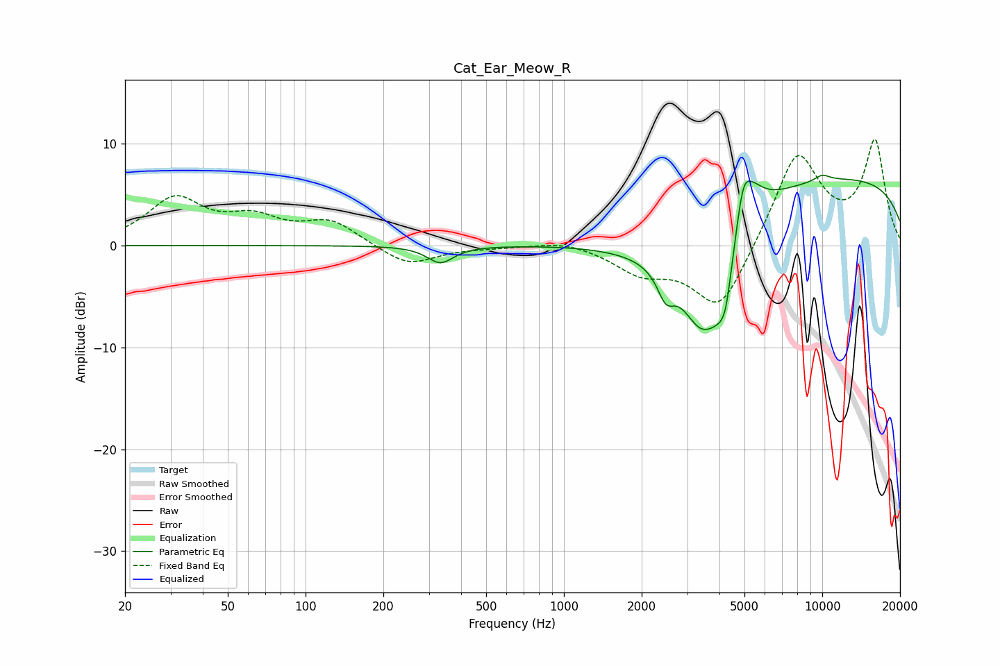

# Cat_Ear_Meow_R
See [usage instructions](https://github.com/jaakkopasanen/AutoEq#usage) for more options and info.

### Parametric EQs
Apply preamp of -7.0 dB when using parametric equalizer.

|   # | Type    |   Fc (Hz) |    Q |   Gain (dB) |
|-----|---------|-----------|------|-------------|
|   1 | Peaking |       333 | 2.79 |        -1.7 |
|   2 | Peaking |      2367 | 0.6  |        -2.2 |
|   3 | Peaking |      2480 | 4.32 |        -2.6 |
|   4 | Peaking |      3416 | 1.52 |        -9.8 |
|   5 | Peaking |      4005 | 3.06 |        -3.6 |
|   6 | Peaking |      4236 | 5.92 |        -3   |
|   7 | Peaking |      4932 | 5.93 |         2.6 |
|   8 | Peaking |      5182 | 2.55 |         4.1 |
|   9 | Peaking |     10000 | 0.18 |         6.8 |
|  10 | Peaking |     10000 | 4.02 |         0.6 |

### Fixed Band EQs
When using fixed band (also called graphic) equalizer, apply preamp of **-10.5 dB** (if available) and set gains manually with these parameters.

|   # | Type    |   Fc (Hz) |    Q |   Gain (dB) |
|-----|---------|-----------|------|-------------|
|   1 | Peaking |        31 | 1.41 |         4.4 |
|   2 | Peaking |        62 | 1.41 |         2.2 |
|   3 | Peaking |       125 | 1.41 |         2.3 |
|   4 | Peaking |       250 | 1.41 |        -2   |
|   5 | Peaking |       500 | 1.41 |        -0.1 |
|   6 | Peaking |      1000 | 1.41 |         0.6 |
|   7 | Peaking |      2000 | 1.41 |        -2.4 |
|   8 | Peaking |      4000 | 1.41 |        -6.6 |
|   9 | Peaking |      8000 | 1.41 |         9.3 |
|  10 | Peaking |     16000 | 1.41 |        10   |

### Graphs

