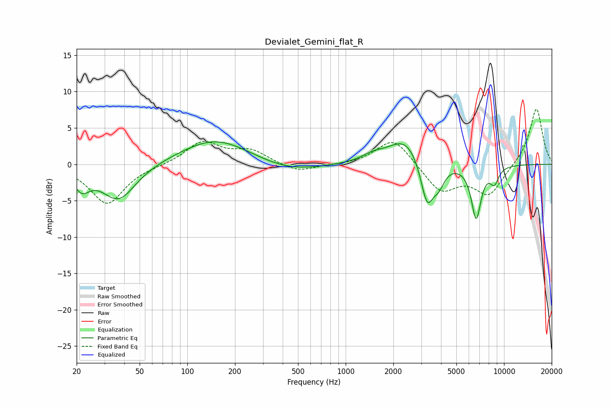

# Devialet_Gemini_flat_R
See [usage instructions](https://github.com/jaakkopasanen/AutoEq#usage) for more options and info.

### Parametric EQs
Apply preamp of -3.2 dB when using parametric equalizer.

|   # | Type    |   Fc (Hz) |    Q |   Gain (dB) |
|-----|---------|-----------|------|-------------|
|   1 | Peaking |        21 | 2.85 |        -2.6 |
|   2 | Peaking |        37 | 1.31 |        -5   |
|   3 | Peaking |       151 | 0.65 |         3.6 |
|   4 | Peaking |       435 | 0.71 |        -1.3 |
|   5 | Peaking |      1488 | 2.08 |         0.8 |
|   6 | Peaking |      2401 | 1.3  |         3.8 |
|   7 | Peaking |      3268 | 3.37 |        -6.4 |
|   8 | Peaking |      3876 | 3.78 |        -2.3 |
|   9 | Peaking |      6668 | 4.4  |        -7.3 |
|  10 | Peaking |      8689 | 4.74 |        -2.1 |

### Fixed Band EQs
When using fixed band (also called graphic) equalizer, apply preamp of **-7.7 dB** (if available) and set gains manually with these parameters.

|   # | Type    |   Fc (Hz) |    Q |   Gain (dB) |
|-----|---------|-----------|------|-------------|
|   1 | Peaking |        31 | 1.41 |        -5.5 |
|   2 | Peaking |        62 | 1.41 |        -0.1 |
|   3 | Peaking |       125 | 1.41 |         3.1 |
|   4 | Peaking |       250 | 1.41 |         1.8 |
|   5 | Peaking |       500 | 1.41 |        -1.2 |
|   6 | Peaking |      1000 | 1.41 |        -0.1 |
|   7 | Peaking |      2000 | 1.41 |         3.7 |
|   8 | Peaking |      4000 | 1.41 |        -3.8 |
|   9 | Peaking |      8000 | 1.41 |        -4.1 |
|  10 | Peaking |     16000 | 1.41 |         7.8 |

### Graphs

